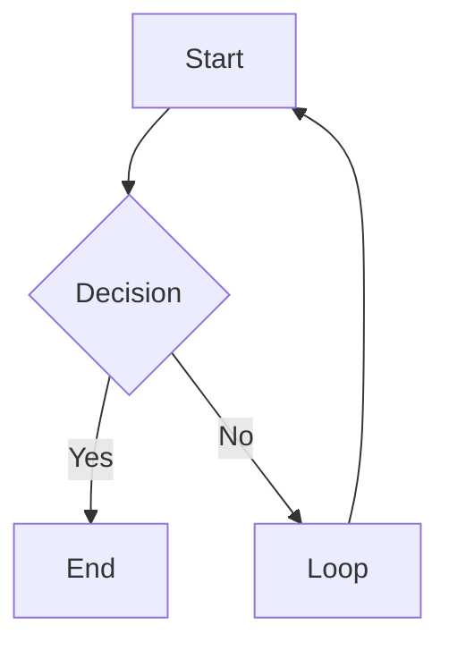

# Obsidian Flavored Markdown

Reference this skill when writing any wiki page. Obsidian extends standard Markdown
with wikilinks, embeds, callouts, and properties. Getting syntax wrong causes broken
links, invisible callouts, or malformed frontmatter.

---

## Wikilinks

Internal links use double brackets. The filename without extension.

| Syntax | What it does |
|---|---|
| `[[Note Name]]` | Basic link |
| `[[Note Name\|Display Text]]` | Aliased link (shows "Display Text") |
| `[[Note Name#Heading]]` | Link to a specific heading |
| `[[Note Name#^block-id]]` | Link to a specific block |

Rules:
- Case-sensitive on some systems. Match the exact filename.
- No path needed: Obsidian resolves by filename uniqueness.
- If two files have the same name, use `[[Folder/Note Name]]` to disambiguate.

---

## Embeds

Embeds use `!` before the wikilink. They display the content inline.

| Syntax | What it does |
|---|---|
| `![[Note Name]]` | Embed a full note |
| `![[Note Name#Heading]]` | Embed a section |
| `![[image.png]]` | Embed an image |
| `![[image.png\|300]]` | Embed image with width 300px |
| `![[diagram.canvas]]` | Embed a Canvas (renders the visual layout inline) |
| `![[document.pdf]]` | Embed a PDF (Obsidian renders natively) |
| `![[audio.mp3]]` | Embed audio |

---

## Callouts

Callouts are blockquotes with a type keyword. They render as styled alert boxes.

```markdown
> [!note]
> Default informational callout.

> [!note] Custom Title
> Callout with a custom title.

> [!note]- Collapsible (closed by default)
> Click to expand.

> [!note]+ Collapsible (open by default)
> Click to collapse.
```

### Built-in callout types

| Type | Aliases | Use for |
|------|---------|---------|
| `note` | — | General notes |
| `abstract` | `summary`, `tldr` | Summaries |
| `info` | — | Information |
| `todo` | — | Action items |
| `tip` | `hint`, `important` | Tips and highlights |
| `success` | `check`, `done` | Positive outcomes |
| `question` | `help`, `faq` | Open questions |
| `warning` | `caution`, `attention` | Warnings |
| `failure` | `fail`, `missing` | Errors or failures |
| `danger` | `error` | Critical issues |
| `bug` | — | Known bugs |
| `example` | — | Examples |
| `quote` | `cite` | Quotations |

### Custom callouts (D&D wiki system — see `ttrpg-writing` → `references/callout-standard.md` for full rules)

**Play callouts** (at-table use):

| Type | Use for | Voice |
|------|---------|-------|
| `read-aloud` | GM performance text — arrivals, introductions, reveals | Full Mercer register |
| `appearance` | Physical description — what the party sees on first look | Mercer register, visual-first |
| `secret` | Hidden info the party hasn't discovered | Terse factual |
| `skill-check` | Actionable DC with context and outcome | Mechanical: `**Skill DC N** — outcome` |
| `mechanic` | Rules, conditions, phase triggers, access requirements | Mechanical, terse |

**Meta callouts** (wiki maintenance):

| Type | Use for |
|------|---------|
| `contradiction` | Conflicting facts — requires GM ruling |

**Deprecated** — do not generate:

| Type | Status |
|------|--------|
| `DM` | Deprecated — migrate to `secret`, `mechanic`, `skill-check`, or delete |
| `gap` | Removed — say "unknown" in text |
| `key-insight` | Removed |
| `stale` | Removed — handled by lint/heal |
| `canon` | Removed — redundant with vault structure |

---

## Properties (Frontmatter)

Obsidian renders YAML frontmatter as a Properties panel. Rules:

```yaml
---
type: entity
title: "Note Title"
campaign: "shattered-sea"
created: 2026-04-08
updated: 2026-04-08
tags:
  - npc
  - shattered-sea
status: active
related:
  - "[[Other Note]]"
sources:
  - "[[source-page]]"
---
```

Rules:
- Flat YAML only. Never nest objects.
- Dates as `YYYY-MM-DD`, not `2026-04-08T00:00:00`.
- Lists as `- item`, not inline `[a, b, c]`.
- Wikilinks in YAML must be quoted: `"[[Page]]"`.
- `tags` field: Obsidian reads this as the tag list, searchable in vault.

---

## Tags

Two valid forms:

```markdown
#tag-name             — inline tag anywhere in the body
#parent/child-tag     — nested tag (shows hierarchy in tag pane)
```

In frontmatter:
```yaml
tags:
  - research
  - npc
```

Do not use `#` inside frontmatter tag lists. Just the tag name.

---

## Text Formatting

| Syntax | Result |
|---|---|
| `**bold**` | Bold |
| `*italic*` | Italic |
| `~~strikethrough~~` | Strikethrough |
| `==highlight==` | Highlighted text (yellow in Obsidian) |
| `` `inline code` `` | Inline code |

---

## Math

Inline: `$E = mc^2$`

Block:
```markdown
$$
\int_0^\infty e^{-x} dx = 1
$$
```

---

## Mermaid Diagrams

Obsidian renders Mermaid natively:

````markdown

````

Supported: `graph`, `sequenceDiagram`, `gantt`, `classDiagram`, `pie`, `flowchart`.

---

## Footnotes

```markdown
This sentence has a footnote.[^1]

[^1]: The footnote text goes here.
```

---

## What NOT to Do

- Do not use `[link text](path/to/note.md)` for internal links — use `[[Note Name]]` instead
- Do not use HTML inside callouts — stick to Markdown
- Do not use `##` inside a callout body — headings don't render inside callouts
- Do not write `tags: [a, b, c]` inline in frontmatter — Obsidian prefers the list format
- Do not write ISO datetimes in frontmatter (`2026-04-08T00:00:00Z`) — use `2026-04-08`

---

## DRY Content Patterns

When writing or editing wiki pages, choose the most dynamic content pattern to avoid
duplication. See CLAUDE.md § DRY & dynamic content for the full governance rules.

### When to use each pattern

| Pattern | Syntax | Use when |
|---|---|---|
| **Base embed** | `![[tracker.base]]` or `![[tracker.base#View]]` | Displaying a list, roster, or table of entities. Bases query frontmatter live — the view updates automatically when entity pages change. |
| **Section embed** | `![[Entity-Name#Section]]` | Displaying a specific section from another page inline. Avoids copy-pasting content that should live in one place. |
| **Full-page embed** | `![[Entity-Name]]` | Embedding an entire page inline (rare — usually a section embed is more precise). |
| **Wikilink** | `[[Entity-Name]]` | Cross-referencing where the reader clicks through to the full page. |
| **Canvas embed** | `![[diagram.canvas]]` | Embedding a visual layout — mind map, flowchart, or relationship diagram. Use for synthesis pages where spatial relationships add meaning. See `obsidian-json-canvas` skill. |
| **Static text** | Plain markdown | Content unique to this page that is not derivable from any entity's frontmatter or existing sections. |

### Anti-patterns to avoid

- **Static tables listing entity status/active problems** — replace with base embeds
- **Paragraph-length descriptions of Entity B on Entity A's page** — use a section embed or compress to one sentence + wikilink
- **Hand-maintained rosters or inventories** — replace with base embeds that query the entity directory
- **"Last Updated" dates on overview pages** — file metadata handles this; remove manual dates
