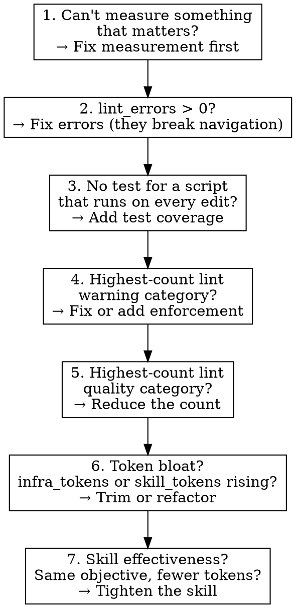

# Continuous Self-Improvement

One run. One problem. Measured before and after. Enforced with code.

---

## Core Discipline

Every run follows the same loop:

```
MEASURE → IDENTIFY → FIX → ENFORCE → VERIFY → LOG
```

**You must complete all six steps.** Skipping any step — especially MEASURE or
VERIFY — invalidates the run. A fix without measurement is a guess. A fix
without enforcement will regress.

---

## Step 1 — MEASURE (mandatory, never skip)

Take an objective health snapshot before doing anything else:

```bash
python3 .claude/scripts/wiki_health_snapshot.py --save --label "before: CSI run"
```

If this script doesn't exist or fails, **that is your issue for this run.**
Build or fix the measurement infrastructure before attempting any other
improvement. You cannot improve what you cannot measure.

Record the snapshot output. You will compare against it in VERIFY.

### What the snapshot captures

| Metric | Source | Why it matters |
|---|---|---|
| `file_count` | filesystem | Vault growth tracking |
| `total_tokens` / `mean_file_tokens` | char count / 4 | Context budget pressure |
| `lint_errors` | wiki_lint.py | Broken navigation, invalid values |
| `lint_warnings` | wiki_lint.py | Standards drift |
| `lint_quality` | wiki_lint.py | Improvement opportunities |
| `lint_by_category` | wiki_lint.py | Where the pain concentrates |
| `orphan_count` / `deadend_count` | wiki_lint.py | Graph connectivity |
| `stub_summaries` | frontmatter scan | Routing quality (vague summaries = bad routing) |
| `pending_ingest` | check_ingest.py | Backlog pressure |
| `hook_count` | settings.json | Enforcement coverage |
| `script_test_count` | filesystem | Infrastructure reliability |
| `infra_tokens` | skills + scripts + hooks + CLAUDE.md | Total token cost of infrastructure |
| `skill_tokens` / `skill_count` | SKILL.md files | Token efficiency of skills |
| `claudemd_tokens` | CLAUDE.md | Cost of always-loaded instructions |
| `scripts_tested` | filesystem | Test coverage ratio (e.g. "2/10") |
| `scripts_without_tests` | filesystem | Which scripts lack tests |
| `infra_inventory` | full scan | Per-file breakdown of all scripts, skills, hooks, rules |

### Token efficiency as a quality signal

Leaner infrastructure that achieves the same results is better — every token
in CLAUDE.md, skills, and scripts is loaded into context and competes with
content for the agent's attention. If a skill can be made shorter without
losing effectiveness, that's an improvement. If a skill becomes longer but
the agent follows it more reliably, that's also an improvement. Use
`infra_tokens` and `skill_tokens` to track this over time.

The inventory breaks down token costs per-skill and per-script, so you can
identify bloated components. A skill with 8000 tokens should justify that
weight; one with 500 tokens that does the same job is strictly better.

### If you can't measure it, fix that first

If the snapshot script is missing, broken, or missing a metric you need to
evaluate your proposed fix — **building or extending the measurement tool IS
your improvement for this run.** This is not a failure; it is the highest-impact
work possible, because every future run depends on it.

---

## Step 2 — IDENTIFY (one problem, highest impact)

Analyze the snapshot to find the single highest-impact issue. Use this priority
stack:



**Rules for identification:**

- **One problem per run.** Not two. Not "while I'm here." One.
- **Pick by the numbers.** The snapshot tells you where the pain is. The
  highest-count category in `lint_by_category` is a strong default when there
  are no errors or missing tests.
- **If you can't quantify the impact of your proposed fix, pick a different
  problem.** "This feels inefficient" is not an issue. "This category has 143
  deadend pages" is.
- **Infrastructure over content.** A lint rule that prevents 50 future issues
  beats fixing 5 issues by hand. A hook that auto-corrects on every write beats
  a skill that reminds the agent.

State the issue in one sentence:
```
ISSUE: {category} — {count} instances — proposed fix: {one-line description}
```

---

## Step 3 — FIX (test-driven, one vertical slice at a time)

Follow TDD. Write the test first, watch it fail, write the minimal fix, watch
it pass.

**REQUIRED:** Load and follow the `tdd` skill for the implementation cycle. The
TDD skill defines the RED-GREEN-REFACTOR loop. This skill does not repeat those
instructions — it adds the constraint that the fix must target the identified
issue.

### What counts as a fix

Use the enforcement stack from `enforced-in-code`. Push the fix as far down the
stack as possible:

| Layer | Mechanism | When to use |
|---|---|---|
| 1 | `permissions.deny` | Block a tool pattern outright |
| 2 | PreToolUse hook | Custom blocking logic |
| 3 | PostToolUse hook | Auto-fix after every write |
| 4 | `wiki_lint.py` rule | Batch detection, cross-file checks |
| 5 | `.claude/rules/*.md` | Path-scoped guidance (judgment calls) |
| 6 | `CLAUDE.md` | Universal guidance (last resort) |

**A fix that only adds documentation is not a fix.** Documentation-only changes
cannot be measured for regression. If the problem can't be enforced with code,
you must either:
1. Find the mechanical subset that CAN be enforced, and enforce that, or
2. Pick a different problem that can be enforced with code.

### Scope guard

If your fix touches more than 3 files (excluding tests), you're over-scoping.
Split the fix or pick a narrower target. The goal is one surgical improvement
per run, not a renovation.

---

## Step 4 — ENFORCE (the fix must be self-sustaining)

Every fix must include a mechanism that prevents regression:

- **Script fix** → add or extend a test in `.claude/scripts/test_*.py`
- **New lint rule** → the rule itself is the enforcement; verify it fires on a
  known-bad file
- **Hook fix** → verify the hook runs on a relevant tool use
- **New hook** → register it in `.claude/settings.json` and test it fires

If the fix has no enforcement mechanism, it will regress. Go back to Step 3
and add one.

---

## Step 5 — VERIFY (mandatory, never skip)

Take a second snapshot and diff against the baseline:

```bash
python3 .claude/scripts/wiki_health_snapshot.py --save --label "after: {one-line description of fix}"
python3 .claude/scripts/wiki_health_snapshot.py --diff
```

The diff must show measurable improvement in at least one metric. Acceptable
outcomes:

| Outcome | Accept? |
|---|---|
| Target metric improved, no other metric regressed | Yes |
| Target metric improved, unrelated metric changed (e.g., file_count from unrelated work) | Yes |
| Target metric improved, related metric regressed slightly | Maybe — justify in the log |
| Small delta on an infrastructure metric (e.g., script_test_count: 1 → 2) | Yes — if the underlying work is real, a small number is fine |
| No measurable change | **No — revert and try again or pick a different issue** |
| Target metric regressed | **No — revert immediately** |

**Metric bias.** The snapshot is weighted toward content signals (lint counts,
orphans, stubs). Infrastructure improvements — adding tests, extending scripts,
improving hooks — move smaller numbers. A `script_test_count` increase of 1 is
a legitimate improvement if the test covers a critical script. Don't chase big
deltas; chase real impact. If the current metrics can't capture the value of a
valid infrastructure fix, extending the snapshot schema IS a valid improvement
for a future run.

### If verification fails

1. Revert your changes: `git checkout -- .`
2. Do NOT attempt a second fix in the same run. The run is over.
3. Log the failure (Step 6) with what you tried and why it didn't work.

---

## Step 6 — LOG (always, even on failure)

Commit the fix with a clear message:

```
feat: CSI — {what changed} ({metric}: {before} → {after})
```

Example:
```
feat: CSI — add wiki_lint rule for empty section headings (deadend_count: 143 → 131)
```

If the run failed (verification showed no improvement), commit nothing but
still log:

```
CSI run {date}: FAILED
  Issue: {what you identified}
  Attempted: {what you tried}
  Result: {what the diff showed}
  Next: {what a future run should try instead}
```

Log this to the daily-log if it exists, or to stdout for the routine to capture.

---

## Red Flags — STOP and Reconsider

| You're about to... | Instead... |
|---|---|
| Fix two things in one run | Pick one. Log the other for tomorrow. |
| Skip the before-snapshot | Stop. Measure first. Always. |
| Add a CLAUDE.md note as your "fix" | Find the code enforcement. Docs aren't fixes. |
| "Improve" something you can't measure | Pick a measurable problem. |
| Manually fix 50 files | Write a script or lint rule that fixes them. |
| Skip verification because "it obviously works" | Take the snapshot. Obvious is wrong often enough. |
| Extend scope because you "found something else" | Log it. Fix it tomorrow. |
| Fix a content problem (lore, prose, missing info) | That's not infrastructure. Use the appropriate content skill. |

---

## What This Skill Does NOT Do

- **Content creation or curation** — use `daily-update`, `ttrpg-writing`, or
  domain prep skills
- **Ingest** — use `ttrpg-wiki-ingest`
- **Full vault audit** — use `ttrpg-llm-wiki-init` Full Audit Mode
- **Lint the vault** — use `ttrpg-wiki-lint` (but this skill may ADD lint rules)

This skill improves the **machinery** — the scripts, hooks, rules, and skills
that other skills depend on.

---

## Bootstrapping: First Runs

On early runs, the measurement infrastructure itself may be incomplete. The
priority stack handles this: "Can't measure something that matters?" is priority
#1. Expected early-run targets:

1. Build `wiki_health_snapshot.py` (if missing)
2. Add tests for existing scripts that lack them
3. Extend the snapshot with metrics the current lint doesn't capture
4. Add lint rules for the largest uncovered issue categories

Once the measurement baseline stabilizes (3+ snapshots with no new metrics
needed), the skill shifts to its steady state: identify → fix → enforce →
verify from the numbers.

The snapshot schema itself may need extending as the wiki matures. Adding a
new metric to the snapshot script is a valid CSI fix — it goes through the same
cycle (measure current coverage gaps → add the metric → test → verify the new
metric populates). Don't add metrics speculatively; add them when you identify
a real problem you can't currently quantify.
