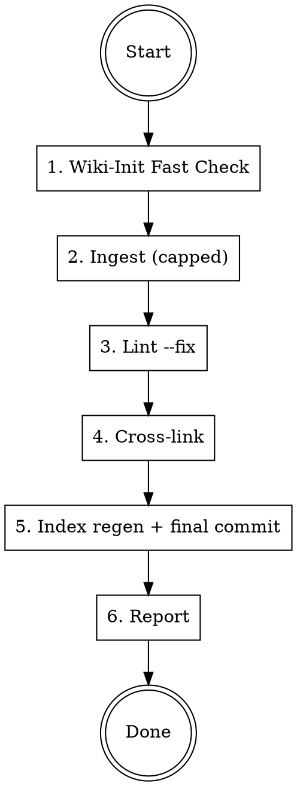
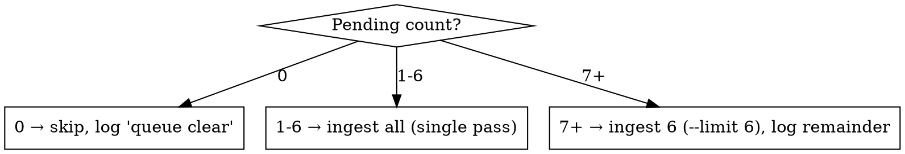

# Daily Update — Autonomous Wiki Maintenance

Quick, safe, daily routine. Touches only mechanical/auto-fixable issues. Defers all
judgment calls. Designed to run unattended — no DM input needed, no canon invented.

**Idempotent:** safe to re-run if interrupted. Wiki-init resumes interrupted work via
`work-queue.md`; ingest dedup prevents double-processing; lint `--fix` is idempotent.

**Error policy:** if any step errors, log the error, commit whatever is clean, and
continue to the next phase. Never abort the entire routine for a single-phase failure.

---

## Skill Chain

Load skills in this order — each is mandatory:

1. `ttrpg-llm-wiki-init` — run Fast Check (validates vault, resumes interrupted work)
2. `ttrpg-wiki-ingest` — only if pending sources exist (capped)
3. `ttrpg-wiki-lint` — auto-fix only, no manual judgment fixes
4. `cross-linker` — only if Obsidian is running

Do not skip steps. Do not reorder.

---

## The Routine



### Step 1 — Wiki-Init Fast Check

Load and run `ttrpg-llm-wiki-init`. It validates structure, auto-corrects deviations,
and resumes any interrupted work-queue tasks. If it finds structural issues, it commits
them with `fix:` prefixes before returning control.

### Step 2 — Ingest (Capped at 6 Sources)

```bash
python3 .claude/scripts/check_ingest.py --count
```



Load `ttrpg-wiki-ingest` and follow its full protocol — including the mandatory dedup
gate, skill chain (writing standards, domain skills), and per-source archive. **Cap at
6 sources per daily run.** Process them in the order `check_ingest.py` returns (do not
cherry-pick or reorder). If more remain, log the count but do not continue — tomorrow's
run picks up where today left off.

Commit per the ingest skill's cadence (typically one commit after all sources in the batch).
If a single source errors during ingest, skip it and continue with the next — log the
failed path so the DM can investigate.

### Step 3 — Lint (Auto-Fix Only)

```bash
python3 .claude/scripts/wiki_lint.py --fix
```

This standardizes frontmatter, reorders fields, coerces booleans — all safe, idempotent,
file-local fixes. Commit if changes were made:

```bash
git add wiki/ && git diff --cached --quiet || git commit -m "curation: daily lint --fix"
```

Then run the linter again in report mode to surface what remains:

```bash
python3 .claude/scripts/wiki_lint.py --summary
```

**Do not manually fix any reported issues.** The daily update only does mechanical fixes.
Judgment items (broken wikilinks, orphans, tag variants, naming conventions) are left for
the DM or an explicit curation session. If errors exist, run `--report` to write
`wiki/dm/review-queue.md` so they're visible:

```bash
python3 .claude/scripts/wiki_lint.py --report
git add wiki/dm/review-queue.md && git diff --cached --quiet || git commit -m "curation: update review queue"
```

### Step 4 — Cross-Link (If Obsidian Running)

```bash
bash .claude/skills/cross-linker/scripts/check-tools.sh
```

- **Tools available:** Load `cross-linker` skill and run it. Cap at 10 orphan pages
  per run (use `-limit 10` on `orphans-clean.sh`). The cross-linker skill references
  `content/` paths — this vault uses `wiki/` as the content root; translate accordingly.
  Commit: `curation: daily cross-link — N links added`
- **Obsidian not running:** Log "cross-linking skipped — Obsidian not running" and
  continue. Do not fail.

### Step 5 — Index Regen + Final Commit

```bash
python3 .claude/scripts/regen_index.py --write
git add wiki/index.md && git diff --cached --quiet || git commit -m "curation: regenerate index"
```

### Step 6 — Report

Output a brief summary (no trailing explanation). For scheduled/cron runs, also
append this summary to `wiki/dm/daily-log.md` (create if missing) so the DM
can review what happened while away.

```
Daily update complete.
- Init: [ok / N fixes]
- Ingest: [N sources processed / queue clear / N remaining]
- Lint: [N auto-fixes / N issues deferred to review queue]
- Cross-link: [N links added / skipped]
- Index: regenerated
- Errors: [none / list of failed steps]
```

---

## Safety Boundaries

These are non-negotiable for autonomous runs:

- **Never invent canon.** Auto-fixes are mechanical (frontmatter, formatting). Content
  is only created during ingest, which follows the ingest skill's extraction protocol.
- **Never make judgment calls.** Broken wikilinks, orphans, tag variants, naming
  conventions, singleton properties — all deferred. Surface them in the review queue.
- **Never exceed the cap.** 6 ingest sources, 10 cross-link orphans. Tomorrow exists.
- **Always commit.** Every phase that changes files gets its own commit. Git history
  is the undo mechanism.
- **Never skip wiki-init.** It catches interrupted work and structural drift.

---

## What This Skill Does NOT Do

- Full audit (use `ttrpg-llm-wiki-init` Full Audit Mode)
- Manual curation (broken links, orphans, tag cleanup — request explicitly)
- Faction clock advancement (use `faction-clock`)
- Session prep (use `prep-session`)
- Content writing or rewriting (use `ttrpg-writing`)

If you're tempted to "just fix one more thing" — stop. The daily update is a bounded
routine, not an open-ended session.
