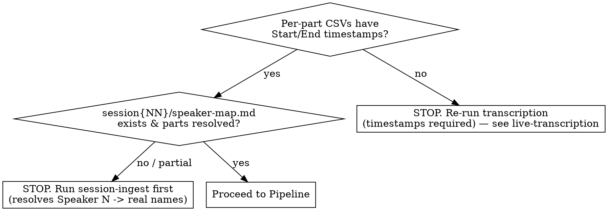

# Session Highlights

Find the moments that got the biggest table laughs and turn each into a **wiki-native
highlight note**: an embedded audio clip plus the full corrected script of the scene, with
every character wikilinked into the campaign graph.

**Core principle: the laugh is the *aftermath*, not the moment.** The detector finds
where people laughed; your job is to walk *backward* to where the bit *started*, fix who
said what, and cut audio that matches. A raw laugh timestamp with a mechanical window is
not a highlight — it's a starting point.

The note is consumed by another agent that generates AI art of each moment, AND it lives in
the Obsidian vault as durable campaign memory. **Art generation is out of scope** — you
produce the note, nothing more.

---

## Hard requirement: in-world moments only

**Every moment in the brief MUST be about the game** — something happening in the fiction:
an in-character line, a character's action, the DM narrating the world, an in-game plan or
spell, a PC's clever move. The art agent illustrates *campaign scenes*; it cannot draw a
real-world aside.

**The one test:** is there a drawable in-world scene — a character *doing something in the
fiction*? Casting a spell, swinging a weapon, speaking in character, sending an in-game
message, making a plan in the world. If yes → **KEEP**, and frame the moment around that
in-world action. If the whole moment is people at a table talking about something *outside
the story* → **DISCARD**, no matter how big the laugh.

**DISCARD only when there is no in-world scene:**
- Real life — jobs, food, family ("I ate fried slugs in Florida"); a real-world premise (a
  coworker wanting a promotion) doesn't become in-world just because a character is name-dropped
  in the punchline. A **name-drop is not an action** — the character must be *doing* something.
- Commentary about the game from outside it — the DM critiquing his own NPC voices, "fuck
  the campaign, he ate slugs," arguing a rule in the abstract.
- Pure pop-culture tangents and table logistics ("you're on speaker") with no in-fiction action.

**KEEP in-world actions even when mechanics or a meta-aside ride along.** A character casting
*Sending* and padding the absurd warning message to hit the word limit is **in-world** — the
spell is a real thing the character does, and "a panicked PC firing off a ridiculous magical
warning" is drawable. The word-count haggling is just the vehicle; frame the brief around the
in-world action (the spell, the message, the scene), not the mechanic. Trim purely-meta asides
(a Dimension-20 reference) from the quoted log; keep the in-world spine.

The detector ranks by laughter, which is scene-blind — so the loudest bursts are often pure
table banter. Filtering those out is the FIRST thing you do, before any refinement. Keep
walking down the ranking until you have **seven** genuine in-world moments (the default
target). Because filtering rejects many, draw from a deeper candidate pool than seven.

**When payoff and setup mix:** an in-world punchline with an OOC lead-in (build-praise → the
character's actual quip) is a **KEEP** — start the clip at the in-world line and trim the OOC
setup. Reserve DISCARD for moments with no in-world action anywhere.

---

## What this skill owns (the five pillars)

The `shattered-audio laughs` script does the *detection*. This skill does the five
things the script can't, because they need judgment:

1. **In-world filter** — discard OOC laughs; keep only moments about the game (see above).
2. **Full scene, both directions** — extend *backward* to capture all the setup, and *forward*
   through the burst's `laugh_end` to capture the follow-on jokes/laughter riding the same wave.
   Include the complete dialogue of that whole span, not a distilled excerpt.
3. **Correct speakers** — resolve attribution against `speaker-map.md`; exclude non-game voices.
4. **Standalone aligned audio** — cut each moment into its **own** audio file containing
   *exactly* that slice (lead-up + moment), and embed that file. The highlight links to the
   slice itself — the reader presses play in place. **Never** point at the original part file
   plus a timestamp ("open part07 at 24:44") and call that the audio; produce the slice.
5. **Wiki-native + linked** — write an Obsidian-compliant note in the vault, with frontmatter
   and `[[wikilinks]]` to every character, resolved to their *canonical* wiki page (see below).

If you only run the script and paste its output, you have done none of these. Don't.

---

## Wiki-native output

The note is a vault page, not a loose file — so the llm-wiki indexes it and its links join the
campaign graph.

**Locations (inside the vault):**
- Note: `wiki/sessions/session-{NN}-highlights.md`
- Clips: `wiki/assets/sessions/session-{NN}/highlight-clips/` (in the vault → embeddable with
  `![[clip.m4a]]`). Cut clips straight here; the audio parts stay in `audio/sessions/`.

**Frontmatter** (the `validate-frontmatter` hook stamps/repairs; write a real `summary`):

```yaml
---
type: session
subtype: session-note
campaign: shattered-sea
status: complete
audience: dm
publish: false
summary: "Seven funniest in-world moments of session {NN}, with clips and full scripts."
session_number: {NN}
tags: [highlights, comedy]
---
```

**Wikilinks — resolve names, never transcribe them.** The transcript spells names *phonetically
and wrong*. Every character must be a `[[wikilink]]` to their **canonical** vault page, found via
the wiki — not the sound the transcriber guessed.

- **REQUIRED SUB-SKILL:** use **ttrpg-wiki-query** to resolve each speaker/NPC to a real page
  before linking. PCs live in `wiki/entities/characters/pcs/`, NPCs in `.../npcs/`.
- Link with a display alias: `[[crissdalynn-khinriss|Crissdalynn]]`, `[[master-kyzil|Kyzil]]`.
  The transcript's "Kaizel" *is* Master Kyzil; "Crystal"/"Crissdalyn" *is* Crissdalynn Khinriss.
- Link NPCs, notable items, and places that have pages too (e.g. `[[sending-stone-nona]]`).
- **No page exists?** Leave the name as plain text and flag it at the top of the note (don't
  invent a link target, don't `[[red-link]]` silently). Creating the page is out of scope here.
- Link a character on **first mention per moment** (speaker label is the natural spot); plain
  text thereafter is fine.

Run `sea fm drift --subtype` if unsure the frontmatter type/subtype matches the path.

---

## Prerequisites (check first)



- Transcripts: `audio/sessions/session{NN}-part*.m4a.csv` with `ID,Start,End,Speaker,Text`.
  No timestamps → you cannot align dialogue to laughs; re-run transcription.
- Speaker map: `audio/sessions/session{NN}/speaker-map.md` from **session-ingest**. Without
  it, attribution will be wrong (mic drift labels `Speaker 1`, etc.). **REQUIRED SUB-SKILL:**
  use session-ingest if speakers are unresolved.
- Tooling: the `shattered-audio` venv. Run the CLI as
  `tools/audio/.venv/bin/shattered-audio laughs ...`. First run downloads the PANNs
  checkpoint (~330 MB) to `~/panns_data/`; needs `ffmpeg` + `wget` on PATH.

---

## Pipeline

### 1. Detect (run the script once)

Full session scan is ~1–2 min per 30-min part (CPU). Produces ranking + draft context + draft clips:

```bash
tools/audio/.venv/bin/shattered-audio laughs \
  audio/sessions/session{NN}-part*.m4a \
  --json audio/sessions/session{NN}/laughs.json \
  --context-out audio/sessions/session{NN}/laughs-draft.md \
  --context-top 20 --context-seconds 60 \
  --clips audio/sessions/session{NN}/highlight-clips-draft
```

Pull a deep candidate pool (top 20) so seven in-world moments survive the filter — the
default brief targets **seven** highlights.

`laughs.json` ranks bursts by **intensity** (loud + sustained = biggest table laughs).
Each entry has `part`, `part_time` (mm:ss local to that part), `session_time`, `duration`,
`peak`, `intensity`, and **`laugh_end`** (local mm:ss where the laughter decays to baseline —
your forward boundary). The draft context/clips are scaffolding — you refine them next.

(If a prior run left only `laughs-draft.md` / `laugh-highlights.md` and no JSON, that markdown
carries the same per-burst metadata — reuse it rather than re-scanning.)

Run `tools/audio/.venv/bin/shattered-audio laughs --help` for all flags.

### 2. Filter, then refine (the judgment loop)

Scan more bursts than you need (the in-world filter will reject many). For each burst, open
the source part CSV (`session{NN}-part{P}.m4a.csv`) and read the dialogue around the laugh:

**a0. Is it in-world?** Judge by the line the laugh lands on (see the classify rule above).
If the laugh is OOC table talk (real life, pop culture, logistics, rules meta), **discard it**
and move to the next burst. Also **merge adjacent bursts from the same scene** into one moment
(the detector often fires twice on one bit). Stop once you have seven in-world moments (the
default target; adjust if asked).

**a. Find the scene bounds and capture the FULL script.** Read *backward* from the laugh to the
start of the bit (a natural conversational boundary) for all the setup, and read *forward*
through the burst's **`laugh_end`** (from `laughs.json` — where laughter decays to baseline) to
catch the follow-on jokes/laughter. Transcribe the **complete** scene across that span — every
line, in order, nothing dropped. Merge fragmented one-word rows into natural sentences and
lightly clean filler, but keep all the content. See `references/finding-boundaries.md`.

**b. Correct speakers, then wikilink them.** Apply `speaker-map.md` (e.g. `Speaker 1 →
Crissdalynn` mic drift) and sanity-check by content (a DM narration line shouldn't stay tagged
as a player). **Exclude** non-game voices. Then resolve every name to its canonical vault page
and wikilink it (see **Wiki-native output** above) — `[[crissdalynn-khinriss|Crissdalynn]]`,
not the transcript's phonetic guess.

**c. Cut the clip** from the scene start through `laugh_end` (plus a beat), into the vault
assets, so the audio covers the same span as the script — setup, moment, and follow-on jokes:

```bash
# start = scene-start local seconds; end ≈ laugh_end + 1s; dur = end - start
ffmpeg -v error -nostdin -y -ss {start} -i audio/sessions/session{NN}-part{P}.m4a \
  -t {dur} -ac 1 wiki/assets/sessions/session{NN}/highlight-clips/{rank}_{slug}.m4a
```

### 3. Write the note

Assemble the refined moments into `wiki/sessions/session-{NN}-highlights.md` (frontmatter +
moments). Output contract is below. Act on any `validate-frontmatter` / `check-wikilinks` hook
warnings before finishing — unresolved wikilinks mean a name didn't resolve to a page.

### 4. Clean up after yourself

The deliverable is the wiki note plus the clips it embeds — nothing else. Remove scaffolding:

```bash
rm -f audio/sessions/session{NN}/laughs-draft.md audio/sessions/session{NN}/laughs.json
rm -rf audio/sessions/session{NN}/highlight-clips-draft
# delete any clip in the vault assets NOT embedded by the final note (rejected/OOC/superseded)
```

After cleanup `wiki/assets/sessions/session{NN}/highlight-clips/` holds only embedded clips, and
no draft scaffolding remains in `audio/sessions/`. Never leave stale or contradictory clips
behind — the next reader can't tell scratch from deliverable.

**Partial runs:** if you only built *some* moments (a sample, or a resume), delete only the
scaffolding and the clips *your* moments supersede. Don't nuke clips or notes for moments
outside your scope — that's someone else's in-progress work.

---

## Output contract

One vault note: `wiki/sessions/session-{NN}-highlights.md`. Frontmatter, then a header (cast
roster with wikilinks + the speaker-resolution note), then one section per moment, ranked, each:
**embedded clip → full script (scene start through the laugh) → section break.**

Conventions:
- Every moment is in-world (OOC discarded upstream).
- **The audio is a standalone slice file, embedded.** Each moment opens with
  `![[{rank}_{slug}_part{P}.m4a]]` — a real file holding exactly that clip. That embed *is* the
  way to hear the moment; the reader never opens a 30-minute part file to find it.
- The **From** line is provenance only (so the slice can be re-cut), not a listening instruction:
  `From session04-part00 @ 12:36–13:04`. The headline anchor is the session-global `session_time`
  from `laughs.json` (keep the JSON until the note is written), or the part-local laugh time if gone.
- Every character is `[[wikilinked]]` to a canonical page on first mention per moment.
- `rank` reflects the moment's order in the final in-world note, not its raw burst rank.

````markdown
---
type: session
subtype: session-note
campaign: shattered-sea
status: complete
audience: dm
publish: false
summary: "Seven funniest in-world moments of session 04, with clips and full scripts."
session_number: 4
tags: [highlights, comedy]
---

# Session 04 — Laughter Highlights

Cast: [[jean-claude-tabarnack|Jean-Claude]] (seabird PC), [[crissdalynn-khinriss|Crissdalynn]],
[[perrin-black-jaw|Perrin]], [[delmar-fisk|Delmar]], DM (voices [[nona-black-jaw|Nona]],
[[master-kyzil|Kyzil]]). Speakers resolved against speaker-map.md; every moment is in-world.
*(Unlinked, no page yet: "Enzo".)*

## 1. {short title} — {session_time}
![[1_bird-rat-human_part00.m4a]]
- **From:** session04-part00 @ 12:36–13:04  (peak 0.33, intensity 0.54)  *(provenance, not a listening cue)*

> **DM:** It doesn't take you long to find them — the four of you are still in downtown Calveno.
> **[[jean-claude-tabarnack|Jean-Claude]]:** *(to a stranger)* Hello. I am looking for a bird, a rat, and a sexy human.
> **[[delmar-fisk|Delmar]]:** …all of a sudden he just smiles for no reason.
> 😂 **— big table laugh —**

---

## 2. {short title} — {session_time}
...
````

Keep dialogue faithful and **complete** — the full scene script, merged into readable lines but
nothing dropped. Do **not** invent lines or change meaning; the clip is the source of truth.

---

## Common mistakes

| Mistake | Fix |
|---|---|
| Including a moment with no in-world scene (jobs, snacks, TV, DM critiquing his own voices) | Discard it — in-world only — and take the next-ranked burst |
| Discarding an in-world action because mechanics ride along (a PC casting Sending, padding the message) | KEEP it — the spell is in-fiction; frame around the action, trim meta asides |
| Pasting the script's fixed-window context as final | Refine every moment: in-world check, setup start, speakers, clip |
| Lead-up starts mid-sentence | Walk back to the premise; start at a natural conversational boundary |
| Missing a setup stored in a run-on row | Transcripts pack long monologues into one 30s+ row — read the row's full text, not just line count |
| Leaving `Speaker 1` / `Speaker 7` labels | Apply speaker-map.md; exclude external/phone voices |
| Transcribing a name as heard ("Kaizel", "Crystal") | Resolve to the canonical page via ttrpg-wiki-query; "Kaizel"→[[master-kyzil]], "Crystal"→[[crissdalynn-khinriss]] |
| Plain-bold names instead of wikilinks | Wikilink every character on first mention so the note joins the graph |
| `[[red-link]]` to a page that doesn't exist | Leave as plain text and flag it; don't invent a target |
| Note written outside the vault (`audio/sessions/`) | Write to `wiki/sessions/`; clips to `wiki/assets/sessions/` so the wiki indexes/embeds them |
| Telling the reader to open part07 at 24:44 | Produce a standalone slice file and embed it (`![[…]]`); the part+timestamp is provenance only |
| Missing frontmatter | Add the YAML block; write a real `summary` (the hook flags a default one) |
| Distilling the script to a few lines | Include the FULL scene script — every line of the lead-up, merged but not dropped |
| Stopping at the first laugh / button | Extend forward through `laugh_end`; keep the follow-on jokes the table was still laughing at |
| Trusting mid-laugh labels | During overlapping laughter, labels drift — attribute by content |
| Clip is laugh±4s only | Cut from the scene start so the clip contains the whole bit, not just the laugh |
| Ending the clip on the burst | The punchline can land AT or AFTER the detected burst — read forward and include the button |
| Ranking confusion | `intensity` = biggest sustained laugh (default). `peak` = loudest spike. Default to intensity |
| Committing draft scaffolding | `laughs-draft.md` / `laughs.json` / `*-draft/` are scratch; the deliverable is the wiki note + embedded clips |

## Red flags — you're not done

- A moment that isn't about the game (real life, pop culture, table logistics)
- Any `Speaker N` left in the note
- A character that's plain text or a phonetic transcript spelling instead of a resolved `[[wikilink]]`
- The note lives outside `wiki/`, or has no frontmatter
- The script is a few cherry-picked lines instead of the full scene
- A moment with no embedded slice file — just a part name and a timestamp to "go listen"
- A clip whose audio doesn't cover the script's span
- You never opened `speaker-map.md` or used ttrpg-wiki-query to resolve names
- Draft scaffolding or rejected clips left behind (you didn't clean up)

All of these mean: go back to the filter/refinement loop.
