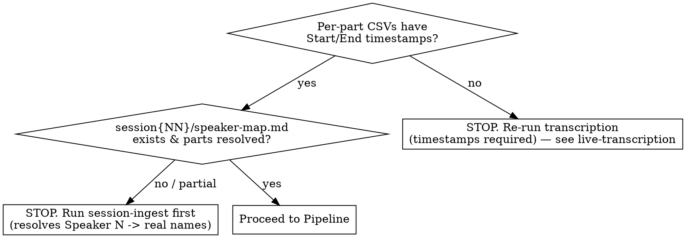

# Session Highlights

Find the moments that got the biggest table laughs and turn each into an **art brief**:
an audio clip plus the corrected dialogue of the joke and the laugh it earned.

**Core principle: the laugh is the *aftermath*, not the moment.** The detector finds
where people laughed; your job is to walk *backward* to where the bit *started*, fix who
said what, and cut audio that matches. A raw laugh timestamp with a mechanical window is
not a highlight — it's a starting point.

The final report is consumed by another agent that generates AI art of each moment.
**Art generation is out of scope** — you produce the brief, nothing more.

---

## Hard requirement: in-world moments only

**Every moment in the brief MUST be about the game** — something happening in the fiction:
an in-character line, a character's action, the DM narrating the world, an in-game plan or
spell, a PC's clever move. The art agent illustrates *campaign scenes*; it cannot draw a
real-world aside.

**Discard out-of-character (OOC) laughs entirely**, no matter how big: real-life table talk
(jobs, food, family), pop-culture references (Trailer Park Boys, movies), table logistics
("you're on speaker"), dice/rules meta-jokes. A huge OOC laugh does **not** belong in the
brief. Drop it and take the next-ranked candidate.

The detector ranks by laughter, which is OOC-blind — so the loudest bursts are often table
banter. Filtering those out is the FIRST thing you do, before any refinement. Keep walking
down the ranking until you have your target count of genuine in-world moments.

**The test for each candidate:** could the art agent draw this as a scene from the Shattered
Sea? If it's a real coworker, a snack, or a 2010s TV show — no. If it's Jean-Claude announcing
the party as "a bird, a rat, and a sexy human" to a stranger in Calveno — yes.

**Classify by the line the laugh lands on, not the whole window** — the two mix constantly:
- In-world payoff, OOC lead-in (build-praise → the character's actual quip): **KEEP**, and
  start the clip at the in-world line, trimming the OOC setup.
- In-world activity, OOC punchline (composing an in-game message, but the laugh is the
  *spell's word-count* or a Dimension-20 aside): **DISCARD** — the art agent can't draw the
  joke even though fiction surrounds it.

---

## What this skill owns (the four pillars)

The `shattered-audio laughs` script does the *detection*. This skill does the four
things the script can't, because they need judgment:

1. **In-world filter** — discard OOC laughs; keep only moments about the game (see above).
2. **Complete setup** — extend each moment's lead-up to the joke's true onset, so the
   payoff has something to land on.
3. **Correct speakers** — resolve and fix attribution against `speaker-map.md`; exclude
   non-game voices.
4. **Aligned audio** — re-cut each clip from the setup start through the laugh, so the
   clip matches the dialogue.

If you only run the script and paste its output, you have done none of these. Don't.

---

## Prerequisites (check first)



- Transcripts: `audio/sessions/session{NN}-part*.m4a.csv` with `ID,Start,End,Speaker,Text`.
  No timestamps → you cannot align dialogue to laughs; re-run transcription.
- Speaker map: `audio/sessions/session{NN}/speaker-map.md` from **session-ingest**. Without
  it, attribution will be wrong (mic drift labels `Speaker 1`, etc.). **REQUIRED SUB-SKILL:**
  use session-ingest if speakers are unresolved.
- Tooling: the `shattered-audio` venv. Run the CLI as
  `tools/audio/.venv/bin/shattered-audio laughs ...`. First run downloads the PANNs
  checkpoint (~330 MB) to `~/panns_data/`; needs `ffmpeg` + `wget` on PATH.

---

## Pipeline

### 1. Detect (run the script once)

Full session scan is ~1–2 min per 30-min part (CPU). Produces ranking + draft context + draft clips:

```bash
tools/audio/.venv/bin/shattered-audio laughs \
  audio/sessions/session{NN}-part*.m4a \
  --json audio/sessions/session{NN}/laughs.json \
  --context-out audio/sessions/session{NN}/laughs-draft.md \
  --context-top 10 --context-seconds 60 \
  --clips audio/sessions/session{NN}/highlight-clips-draft
```

`laughs.json` ranks bursts by **intensity** (loud + sustained = biggest table laughs).
Each entry has `part`, `part_time` (mm:ss local to that part), `session_time`, `duration`,
`peak`, `intensity`. The draft context/clips are scaffolding — you refine them next.

(If a prior run left only `laughs-draft.md` / `laugh-highlights.md` and no JSON, that markdown
carries the same per-burst metadata — reuse it rather than re-scanning.)

Run `tools/audio/.venv/bin/shattered-audio laughs --help` for all flags.

### 2. Filter, then refine (the judgment loop)

Scan more bursts than you need (the in-world filter will reject many). For each burst, open
the source part CSV (`session{NN}-part{P}.m4a.csv`) and read the dialogue around the laugh:

**a0. Is it in-world?** Judge by the line the laugh lands on (see the classify rule above).
If the laugh is OOC table talk (real life, pop culture, logistics, rules meta), **discard it**
and move to the next burst. Also **merge adjacent bursts from the same scene** into one moment
(the detector often fires twice on one bit). Stop once you have your target count of in-world
moments.

**a. Find the true setup start.** Read backward from the laugh. The start is the first line
of the *bit* — where the premise begins — not a fixed N seconds before. End one beat *after*
the laugh fires (the "button"). See `references/finding-boundaries.md`.

**b. Correct speakers.** Apply `speaker-map.md` (e.g. `Speaker 1 → Crissdalyn` mic drift).
Then sanity-check by content: a line that's clearly the DM narrating should not stay tagged
as a player. **Exclude** non-game voices the map flags (e.g. an external phone caller).

**c. Re-cut the clip** from the setup start through the button, so audio matches dialogue:

```bash
# start/dur are LOCAL seconds within the part file
ffmpeg -v error -nostdin -y -ss {start} -i audio/sessions/session{NN}-part{P}.m4a \
  -t {dur} -ac 1 audio/sessions/session{NN}/highlight-clips/{rank}_{slug}.m4a
```

### 3. Write the brief

Assemble the refined moments into the final report. Output contract is below.

---

## Output contract (read by the art agent)

One file: `audio/sessions/session{NN}/highlights-for-art.md`. Header with the cast roster
(for art reference) and the speaker-resolution note. Then one section per moment, ranked,
each: **audio path → corrected chat log (setup through the laugh) → section break.**

Conventions:
- Every moment is in-world (OOC discarded upstream) — no OOC tags appear here.
- Clip filename: `{rank}_{slug}_part{P}.m4a` (e.g. `2_bird-rat-human_part00.m4a`).
- **Source** line shows the clip's *actual* span (after you extend setup/button); the headline
  `session_time` is the laugh anchor and may sit inside that span.
- `rank` reflects the moment's order in the final in-world brief, not its raw burst rank.

```markdown
# Session {NN} — Laughter Highlights (art brief)

Cast (for art reference): Jean-Claude (anthropomorphic seabird PC), Delmar (...), ...
Speakers resolved against speaker-map.md; mic-drift and external voices corrected.
Every moment below is in-world (out-of-character table banter excluded).

## 1. {short title} — {session_time}
- **Audio:** audio/sessions/session{NN}/highlight-clips/1_bird-rat-human_part00.m4a
- **Source:** session04-part00 @ 12:40–13:04  (peak 0.33, intensity 0.54)

> **DM:** You're still in downtown Calveno, the district packed around you.
> **Jean-Claude:** *(to a stranger)* Hello. I am looking for a bird, a rat, and a sexy human.
> **Delmar:** …all of a sudden he just smiles for no reason.
> 😂 **— big table laugh —**

---

## 2. {short title} — {session_time}
...
```

Keep dialogue faithful but readable: you may merge the transcript's fragmented one-word rows
into natural lines and lightly clean filler. Do **not** invent lines or change meaning — the
clip is the source of truth.

---

## Common mistakes

| Mistake | Fix |
|---|---|
| Including a big OOC laugh (jobs, snacks, TV references, rules meta) | Discard it — in-world only — and take the next-ranked burst |
| Pasting the script's fixed-window context as final | Refine every moment: in-world check, setup start, speakers, clip |
| Lead-up starts mid-sentence | Walk back to the premise; start at a natural conversational boundary |
| Missing a setup stored in a run-on row | Transcripts pack long monologues into one 30s+ row — read the row's full text, not just line count |
| Leaving `Speaker 1` / `Speaker 7` labels | Apply speaker-map.md; exclude external/phone voices |
| Trusting mid-laugh labels | During overlapping laughter, labels drift — attribute by content |
| Clip is laugh±4s only | Re-cut from setup start so the clip contains the joke, not just the laugh |
| Ending the clip on the burst | The punchline can land AT or AFTER the detected burst — read forward and include the button |
| Ranking confusion | `intensity` = biggest sustained laugh (default). `peak` = loudest spike. They differ; default to intensity unless asked |
| Committing draft scaffolding | `laughs-draft.md` and `*-draft/` clips are scratch; the deliverable is `highlights-for-art.md` + refined clips |

## Red flags — you're not done

- A moment that isn't about the game (real life, pop culture, table logistics)
- Any `Speaker N` left in the brief
- Any highlight whose first line starts mid-thought
- A clip whose audio doesn't include the joke setup
- You never opened `speaker-map.md`

All of these mean: go back to the filter/refinement loop.
