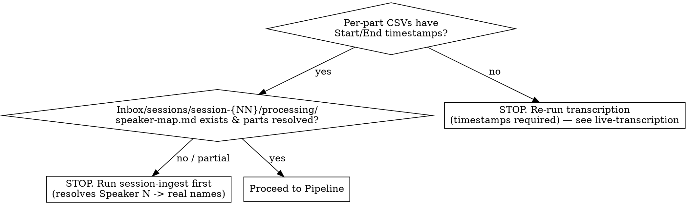

# Session Highlights

Find the moments that got the biggest table laughs and turn each into its own **screenplay
scene file**: a self-contained, drawable scene — wiki-staged setting + character appearance,
in-fiction action lines, faithful in-character dialogue — with the audio clip embedded at the
end. A thin **index note** ties the seven scenes together with wikilinks.

**Core principle: the laugh is the *aftermath*, not the moment.** The detector finds
where people laughed; your job is to walk *backward* to where the bit *started*, fix who
said what, cut audio that matches, and **re-stage it as a scene**. A raw laugh timestamp with
a mechanical window is not a highlight — it's a starting point.

The output is consumed by another agent that generates AI art of each moment, AND it lives in
the Obsidian vault as durable campaign memory. The split (one scene per file, enriched with
drawable detail) exists so that downstream agent can read **one self-contained scene** and
illustrate it without chasing the campaign graph. **Art generation is out of scope** — you
produce the scene files and the index, nothing more.

---

## Hard requirement: in-world moments only

**Every moment in the brief MUST be about the game** — something happening in the fiction:
an in-character line, a character's action, the DM narrating the world, an in-game plan or
spell, a PC's clever move. The art agent illustrates *campaign scenes*; it cannot draw a
real-world aside.

**The one test:** is there a drawable in-world scene — a character *doing something in the
fiction*? Casting a spell, swinging a weapon, speaking in character, sending an in-game
message, making a plan in the world. If yes → **KEEP**, and frame the moment around that
in-world action. If the whole moment is people at a table talking about something *outside
the story* → **DISCARD**, no matter how big the laugh.

**DISCARD only when there is no in-world scene:**
- Real life — jobs, food, family ("I ate fried slugs in Florida"); a real-world premise (a
  coworker wanting a promotion) doesn't become in-world just because a character is name-dropped
  in the punchline. A **name-drop is not an action** — the character must be *doing* something.
- Commentary about the game from outside it — the DM critiquing his own NPC voices, "fuck
  the campaign, he ate slugs," arguing a rule in the abstract.
- Pure pop-culture tangents and table logistics ("you're on speaker") with no in-fiction action.

**KEEP in-world actions even when mechanics or a meta-aside ride along.** A character casting
*Sending* and padding the absurd warning message to hit the word limit is **in-world** — the
spell is a real thing the character does, and "a panicked PC firing off a ridiculous magical
warning" is drawable. The word-count haggling is just the vehicle; frame the brief around the
in-world action (the spell, the message, the scene), not the mechanic. Trim purely-meta asides
(a Dimension-20 reference) from the quoted log; keep the in-world spine.

The detector ranks by laughter, which is scene-blind — so the loudest bursts are often pure
table banter. Filtering those out is the FIRST thing you do, before any refinement. Keep
walking down the ranking until you have **seven** genuine in-world moments (the default
target). Because filtering rejects many, draw from a deeper candidate pool than seven.

**When payoff and setup mix:** an in-world punchline with an OOC lead-in (build-praise → the
character's actual quip) is a **KEEP** — start the clip at the in-world line and trim the OOC
setup. Reserve DISCARD for moments with no in-world action anywhere.

---

## What this skill owns (the five pillars)

The `shattered-audio laughs` script does the *detection*. This skill does the five
things the script can't, because they need judgment:

1. **In-world filter** — discard OOC laughs; keep only moments about the game (see above).
2. **Full scene + true physical blocking** — extend *backward* to capture all the setup, and
   *forward* through the burst's `laugh_end` to capture the follow-on jokes riding the same wave.
   Capture the complete span — but also read **far enough back to establish what is physically
   happening**: where each character is, whether they're flying / swimming / standing / grappling,
   and what just happened mechanically (a grapple, a dive, a fall) that sets the scene. The laugh
   window almost never states the blocking — it was established minutes earlier. **The transcript
   is ground truth for the physical scene; getting it wrong renders the whole scene wrong.**
3. **Correct speakers** — resolve attribution against `speaker-map.md`; exclude non-game voices.
4. **Standalone aligned audio** — cut each moment into its **own** audio file containing
   *exactly* that slice (lead-up + moment), and embed it at the end of that scene's file.
   **Never** point at the original part file plus a timestamp ("open part07 at 24:44") and call
   that the audio; produce the slice.
5. **Screenplay scene files + thin index** — write each moment as its own vault page: a short
   **screenplay** that stages the scene with wiki-sourced setting and character appearance, turns
   the table-talk into action lines + faithful in-character dialogue, and embeds the clip at the
   end. A thin index note links the seven scenes. Every name is a `[[wikilink]]` to its *canonical*
   page. See **Screenplay scene files** below and `references/screenplay-format.md`.

If you only run the script and paste its output, you have done none of these. Don't.

---

## Output shape: thin index + seven scene files

The deliverable is **eight vault pages**, not one — so each scene is self-contained for the
downstream art agent and the llm-wiki indexes them all:

| File | What it is |
|---|---|
| `wiki/sessions/session-{NN}-highlights.md` | **Thin index** — frontmatter, cast roster, discarded-OOC list, and seven `[[wikilinks]]` to the scene files. Mostly links; no scripts inline. |
| `wiki/sessions/session-{NN}-highlight-{n}-{slug}.md` ×7 | One **screenplay scene** each: title → setting/cast blocks → screenplay → embedded clip at the end. |
| `wiki/assets/sessions/session-{NN}/highlight-clips/{rank}_{slug}_part{P}.m4a` ×7 | The standalone audio slices (in the vault → embeddable). Cut straight here; the audio parts stay in `.raw/sessions/`. |

This mirrors the existing `session-{NN}.md` → `session-{NN}-scene-*.md` convention already in the
vault. The scene files are the deliverable's substance; the index is a table of contents.

**Frontmatter** — both the index and each scene file are `subtype: session-note` (the
`validate-frontmatter` hook stamps/repairs; write a real `summary` for each):

```yaml
# index — session-{NN}-highlights.md
---
type: session
subtype: session-note
campaign: shattered-sea
status: complete
audience: dm
publish: false
summary: "Index of the seven funniest in-world moments of session {NN} — links to each screenplay scene."
session_number: {NN}
tags: [grung]   # canonical content tags only (species/faction/theme) — the lint step rejects unknown & entity-name tags
---

# scene — session-{NN}-highlight-{n}-{slug}.md
---
type: session
subtype: session-note
campaign: shattered-sea
status: complete
audience: dm
publish: false
summary: "Highlight {n} of session {NN}: {one-line of what the scene is}."
session_number: {NN}
tags: [grung]
---
```

**Wikilinks — resolve names, never transcribe them.** The transcript spells names *phonetically
and wrong*. Every character must be a `[[wikilink]]` to their **canonical** vault page, found via
the wiki — not the sound the transcriber guessed.

- **REQUIRED SUB-SKILL:** use **ttrpg-wiki-query** to resolve each speaker/NPC to a real page
  before linking. PCs live in `wiki/entities/characters/pcs/`, NPCs in `.../npcs/`.
- Link with a display alias: `[[crissdalynn-khinriss|Crissdalynn]]`, `[[master-kyzil|Kyzil]]`.
  The transcript's "Kaizel" *is* Master Kyzil; "Crystal"/"Crissdalyn" *is* Crissdalynn Khinriss.
- Link NPCs, notable items, and places that have pages too (e.g. `[[sending-stone-nona]]`).
- **No page exists?** Leave the name as plain text and flag it at the top of the note (don't
  invent a link target, don't `[[red-link]]` silently). Creating the page is out of scope here.
- Link a character on **first mention per scene file** (the Setting block is the natural spot);
  plain text thereafter is fine.

Run `sea fm drift --subtype` if unsure the frontmatter type/subtype matches the path.

---

## Screenplay scene files

Each highlight is its own scene file written as a short **screenplay** — a self-contained,
drawable scene the downstream art agent can illustrate without opening any other page. Full
template and craft rules: `references/screenplay-format.md`. The essentials:

**Two sources of truth, never crossed:**
- **What was said and what happened** is fixed by the transcript + the embedded clip. In-character
  dialogue stays **faithful** (lightly cleaned, never reworded for flavor); declared actions are
  rendered as written, never invented. The clip is provenance — the script must not drift from it.
- **How the scene looks** comes from the **wiki** (`ttrpg-wiki-query`): the slugline location, the
  light/atmosphere, and each character's appearance. This is the enrichment that makes the file
  drawable. You are re-staging a real moment with real set-dressing — **not** writing fan fiction.

**Translate the table-talk:**
- In-character speech → **dialogue**, verbatim (e.g. *"I am looking for a bird, a rat, and a sexy
  human"*).
- First-person action declarations → **action lines**, third person present tense (e.g. "I pull
  the dagger out" → *Jean-Claude plucks the dagger from his shirt; it dissolves into smoke*).
- DM "as the NPC" → **dialogue** under the NPC's name. DM world-narration → action lines.
- Keep the laugh beat in script order: `> 😂 **— big table laugh —**`.

**Layout (per scene file):** title → `> [!info] Setting` block (Where / Who-with-appearance /
Beat) → `## Screenplay` (slugline, action, dialogue, the laugh) → `## Audio` (the embed + a
provenance `From` line) **at the end**. The art agent reads the screenplay top-to-bottom, then can
press play.

---

## Prerequisites (check first)



- Transcripts: `.raw/sessions/session-{NN}/transcripts/raw/session-{NN}-part-*.csv` with `ID,Start,End,Speaker,Text`.
  No timestamps → you cannot align dialogue to laughs; re-run transcription.
- Speaker map: `Inbox/sessions/session-{NN}/processing/speaker-map.md` (or `.raw/sessions/session-{NN}/ingest/speaker-map.md` if already accepted) from **session-ingest**. Without
  it, attribution will be wrong (mic drift labels `Speaker 1`, etc.). **REQUIRED SUB-SKILL:**
  use session-ingest if speakers are unresolved.
- Tooling: the `shattered-audio` venv. Run the CLI as
  `tools/audio/.venv/bin/shattered-audio laughs ...`. First run downloads the PANNs
  checkpoint (~330 MB) to `~/panns_data/`; needs `ffmpeg` + `wget` on PATH.

---

## Pipeline

Four things make this pipeline work — skip any and scenes come out wrong (or expensive):
- **The transcript is ground truth for the physical scene.** Read it back far enough to establish
  the blocking (flying/swimming/standing/grappling) before staging — the laugh window won't tell you.
- **Gather the shared lore once, up front** (step 2c) into a `lore-pack.md` the subagents read — the
  recurring cast is looked up a single time, not re-queried inside all seven subagents.
- **Each moment gets its own subagent on a cheaper model** (step 3) whose paramount job is accurate
  recreation — it reads its own transcript window deeply and returns a terse report, so seven scenes
  don't share one shallow read and the orchestration context stays small.
- **Bookended by two chain-loaded sub-skills, both mandatory:** chain-load **ttrpg-wiki-query**
  before staging (to build the lore pack), and **ttrpg-wiki-lint** after writing (frontmatter, tags,
  every `[[wikilink]]`).

### 1. Detect (run the script once)

Full session scan is ~1–2 min per 30-min part (CPU). Produces ranking + draft context + draft clips:

```bash
tools/audio/.venv/bin/shattered-audio laughs \
  .raw/sessions/session-{NN}/audio/parts/session-{NN}-part-*.m4a \
  --json .raw/sessions/session-{NN}/laughs.json \
  --context-out .raw/sessions/session-{NN}/laughs-draft.md \
  --context-top 20 --context-seconds 60 \
  --clips Inbox/sessions/session-{NN}/scratch/highlight-clips-draft
```

Pull a deep candidate pool (top 20) so seven in-world moments survive the filter — the
default brief targets **seven** highlights.

`laughs.json` ranks bursts by **intensity** (loud + sustained = biggest table laughs).
Each entry has `part`, `part_time` (mm:ss local to that part), `session_time`, `duration`,
`peak`, `intensity`, and **`laugh_end`** (local mm:ss where the laughter decays to baseline —
your forward boundary). The draft context/clips are scaffolding — you refine them next.

(If a prior run left only `laughs-draft.md` / `laugh-highlights.md` and no JSON, that markdown
carries the same per-burst metadata — reuse it rather than re-scanning.)

Run `tools/audio/.venv/bin/shattered-audio laughs --help` for all flags.

### 2. Filter, then refine (the judgment loop)

Scan more bursts than you need (the in-world filter will reject many). For each burst, open
the source part CSV (`.raw/sessions/session-{NN}/transcripts/raw/session-{NN}-part-{P}.csv`) and read the dialogue around the laugh:

**a0. Is it in-world?** Judge by the line the laugh lands on (see the classify rule above).
If the laugh is OOC table talk (real life, pop culture, logistics, rules meta), **discard it**
and move to the next burst. Also **merge adjacent bursts from the same scene** into one moment
(the detector often fires twice on one bit). Stop once you have seven in-world moments (the
default target; adjust if asked).

**a. Find the scene bounds and capture the full span.** Read *backward* from the laugh to the
start of the bit (a natural conversational boundary) for all the setup, and read *forward*
through the burst's **`laugh_end`** (from `laughs.json` — where laughter decays to baseline) to
catch the follow-on jokes/laughter. Capture the **complete** scene across that span — every
line, in order, nothing dropped. This is the raw material; you'll stage it as a screenplay in
step 3. See `references/finding-boundaries.md`.

**a1. Establish the physical blocking — read further back than the bit.** The dialogue around the
laugh tells you the *joke*; it rarely tells you the *scene*. Before staging, read enough of the
transcript leading up to the moment — often **2–3 minutes earlier** — to answer concretely:
*where is each character, and what are they physically doing?* Are they flying, swimming, standing,
riding, grappling, falling? What just happened mechanically (a grapple landed, someone dove, a
spell went off) that put them there? Scan for the literal cues — "how high up are we?", "outside
the tunnel now", "I pulled him 20 feet up" — they pin the blocking precisely. **Never infer the
physical scene from the laugh window or from the wiki's vibe.** Getting flying-vs-swimming or
who-holds-whom wrong renders the entire scene wrong (see Common mistakes). The transcript is the
single source of truth for what is physically happening.

**b. Correct speakers, then wikilink them.** Apply `speaker-map.md` (e.g. `Speaker 1 →
Crissdalynn` mic drift) and sanity-check by content (a DM narration line shouldn't stay tagged
as a player). **Exclude** non-game voices. Then resolve every name to its canonical vault page
and wikilink it (see **Wikilinks** above) — `[[crissdalynn-khinriss|Crissdalynn]]`,
not the transcript's phonetic guess.

**c. Build the shared lore pack — ONCE, up front.** The seven moments share a cast: the same PCs,
the recurring NPCs, a handful of locations and items show up across many scenes. Looking each one up
*inside* every subagent means querying the same character six or seven times — wasteful and prone to
drift. Instead, gather it **once** here and hand the finished pack to every subagent.

**REQUIRED SUB-SKILL:** chain-load **ttrpg-wiki-query** (it is cheap to delegate this whole gather to
a single research subagent on a cheaper model). Collect, from canonical pages — not memory:
- every **PC**'s appearance (species, build, signature gear, colours) + voice/manner,
- each **recurring NPC** that appears across the moments, same detail,
- the **locations** the moments touch (look, light, atmosphere),
- recurring **items / creatures / in-world facts** the scenes turn on (what a spell or item does,
  who holds what, a creature's caste/abilities).

Write the result to a scratch file — `.raw/sessions/session-{NN}/lore-pack.md` — as a compact,
wikilink-keyed list (one tight line per entity: `[[slug|Name]]: appearance · manner · key fact`).
Each subagent reads this one file instead of re-querying. **Scene-unique** entities (a one-off NPC in
just one moment) are *not* in the pack — that moment's subagent looks those up itself. Don't invent;
if a page is missing, note the gap in the pack. Delete the scratch file in cleanup (step 4).

**d. Cut the clip** from the scene start through `laugh_end` (plus a beat), into the vault
assets, so the audio covers the same span as the script — setup, moment, and follow-on jokes:

```bash
# start = scene-start local seconds; end ≈ laugh_end + 1s; dur = end - start
# clip name MUST match the embed: {rank}_{slug}_part{P}.m4a (P = source part number, no dash)
ffmpeg -v error -nostdin -y -ss {start} -i .raw/sessions/session-{NN}/audio/parts/session-{NN}-part-{PP}.m4a \
  -t {dur} -ac 1 wiki/assets/sessions/session-{NN}/highlight-clips/{rank}_{slug}_part{P}.m4a
```

### 3. Write the scene files — one subagent per moment

**Dispatch one subagent per moment, in parallel, on a cheaper model.** Each scene lives or dies on
getting *its* details exactly right, and that takes a focused read of the transcript around that one
moment — more than you can do well for seven moments in one context. So delegate each moment to its
own subagent whose **paramount, non-negotiable job is to recreate the scene accurately.** The work
(read a transcript window → translate to a screenplay) is well within a **cheaper model's** ability —
dispatch the subagents on **Sonnet** and keep the top model for *your* orchestration (planning, the
lore pack, the index). Token efficiency is built into how you brief them, below.

**Model choice — Sonnet is the floor for fidelity.** Tested head-to-head on the hardest blocking
moment, Haiku got the *physical blocking* right (flying vs. swimming, who holds whom) and cited the
cues — but it regressed on craft: it emitted entity-name/unknown **tags** the lint rejects, **dropped
the follow-on jokes** that ride the laugh through `laugh_end`, kept table-meta phrasing as dialogue,
and invented a small detail (time of day). So: **Sonnet by default.** Use Haiku only for a trivially
short, single-exchange moment, and if you do, lint the result hard and check the forward boundary
wasn't truncated.

Give each subagent everything it needs to stand alone — it does NOT share your context:

- The moment's identity: rank `{n}`, slug, clip filename, `From` provenance (part `{P}`, laugh
  window, `laugh_end`), and the scene-file path to write.
- **The lore-pack path** (`.raw/sessions/session-{NN}/lore-pack.md`) — its canon source, already
  gathered. It reads this, and does **not** re-query the recurring cast.
- The transcript path + a **targeted window**, so it never loads the whole 30-min CSV. Give the
  byte-cheap extract command, e.g.:
  ```bash
  # pull ~3 min before the laugh through laugh_end+ from the part CSV
  awk -F',' 'NR==1||($2>="{HH:MM}"&&$2<="{HH:MM}")' .raw/sessions/session-{NN}/transcripts/raw/session-{NN}-part-{P}.csv
  ```
- The `speaker-map.md` path, the output contract, and `references/screenplay-format.md`.

Instruct each subagent, in its own words:

> Accuracy is paramount. **Read the transcript window from ~3 min before the laugh through
> `laugh_end`** to establish the physical blocking: where every character is and what they are
> physically doing (flying / swimming / standing / grappling / falling), and what put them there.
> Quote the literal cues ("how high up are we?", "20 feet up", "outside the tunnel"). Do NOT infer
> the scene from the laugh window or from the lore. Read the lore-pack file for appearance + canon
> facts; only query the wiki yourself for an entity the pack doesn't cover. Resolve speakers via
> speaker-map.md. Write the scene file as a screenplay (title → Setting block → screenplay → `##
> Audio` embed at the end). Then reply with a **terse report only** — the blocking you established,
> the 2–3 transcript cues that prove it, and any gap. **Do not echo the file body back.**

The terse report keeps the orchestration context small. Read each report; **if it can't cite
transcript evidence for the blocking, send it back to read more** — a confidently-wrong physical
scene is the failure this guards against.

Then **you** write the thin index `wiki/sessions/session-{NN}-highlights.md`: frontmatter, cast
roster, discarded-OOC list, and a ranked list of `[[wikilinks]]` to the seven scene files — mostly
links, no scripts inline. Output contract is below. Act on any `validate-frontmatter` /
`check-wikilinks` hook warnings on **every** file — unresolved wikilinks mean a name didn't resolve.

### 4. Clean up after yourself

The deliverable is the index + seven scene files + the seven clips they embed — nothing else.
Remove scaffolding:

```bash
rm -f .raw/sessions/session-{NN}/laughs-draft.md .raw/sessions/session-{NN}/laughs.json
rm -f .raw/sessions/session-{NN}/lore-pack.md   # the shared staging pack — scratch, not a deliverable
rm -rf Inbox/sessions/session-{NN}/scratch/highlight-clips-draft
# delete any clip in the vault assets NOT embedded by a final scene file (rejected/OOC/superseded)
```

After cleanup `wiki/assets/sessions/session-{NN}/highlight-clips/` holds only embedded clips, and
no draft scaffolding remains in `.raw/sessions/` or `Inbox/sessions/`. Never leave stale or contradictory clips
behind — the next reader can't tell scratch from deliverable.

**Partial runs:** if you only built *some* moments (a sample, or a resume), delete only the
scaffolding and the clips *your* scene files supersede. Don't nuke clips or files for moments
outside your scope — that's someone else's in-progress work.

### 5. Lint the new pages

The index and scene files are new vault pages — finish by cleaning them up like any other.
**REQUIRED SUB-SKILL:** chain-load **ttrpg-wiki-lint** and run it on the **whole set** (index +
seven scenes) to fix frontmatter (a real `summary` per file, a sane `tags` set, stamped dates),
tag hygiene, and to confirm every `[[wikilink]]` resolves — including the index's links to the
scene files. Act on what it reports — resolve or flag any link it can't, fill any placeholder
frontmatter (`sources`/`session_date` default to "unknown" from the hook). The deliverable isn't
done until the lint is clean on all eight pages.

---

## Output contract

Eight vault pages: a thin index plus seven screenplay scene files. Clips live in the vault assets.

**Conventions:**
- Every moment is in-world (OOC discarded upstream).
- The **index** is mostly wikilinks — no scripts inline. The **scenes** carry the scripts.
- **The audio is a standalone slice file, embedded at the end of each scene file** under `## Audio`:
  `![[{rank}_{slug}_part{P}.m4a]]` — a real file holding exactly that clip. That embed *is* the
  way to hear the moment; the reader never opens a 30-minute part file to find it.
- The **From** line is provenance only (so the slice can be re-cut), not a listening instruction.
  The headline/Setting anchor is the session-global `session_time` from `laughs.json` (keep the
  JSON until the files are written), or the part-local laugh time if gone.
- Every character is `[[wikilinked]]` to a canonical page on first mention per file.
- `{n}` / `rank` reflects the moment's final order, not its raw burst rank.

**Index — `session-{NN}-highlights.md`:**

````markdown
---
type: session
subtype: session-note
campaign: shattered-sea
status: complete
audience: dm
publish: false
summary: "Index of the seven funniest in-world moments of session 04 — links to each screenplay scene."
session_number: 4
tags: [grung]   # canonical content tags only (species/faction/theme) — the lint step rejects unknown & entity-name tags
---

# Session 04 — Laughter Highlights

Cast: [[jean-claude-tabarnack|Jean-Claude]] (grung ranger), [[crissdalynn-khinriss|Crissdalynn]]
(crow aarakocra monk), [[perrin-black-jaw|Perrin]] (rattkin bard), [[delmar-fisk|Delmar]], DM
(voices [[nona-black-jaw|Nona]], [[master-kyzil|Kyzil]]). Speakers resolved against
speaker-map.md; every scene is in-world. *(Unlinked, no page yet: "Enzo".)*

Seven screenplay scenes, ranked by table laugh:

1. [[session-04-highlight-1-grung-capture|"Little secret from Nona" — the grung gets monologued]]
2. [[session-04-highlight-2-dagger-cigarette|The cigarette assassin — pinned to the chair]]
3. [[session-04-highlight-3-bird-rat-human|"A bird, a rat, and a sexy human"]]
4. … (4–7)

## Discarded as out-of-world (OOC)
- **#1 (30:38, loudest burst):** real-life fried-slug food story. Pure table banter.
- … (the rejected bursts, so the next reader sees what was considered)
````

**Scene — `session-{NN}-highlight-{n}-{slug}.md`** (full template in `references/screenplay-format.md`):

````markdown
---
type: session
subtype: session-note
campaign: shattered-sea
status: complete
audience: dm
publish: false
summary: "Highlight 3 of session 04: Jean-Claude announces himself to a Calveno crowd looking for 'a bird, a rat, and a sexy human.'"
session_number: 4
tags: [grung]
---

# Session 04 · Highlight 3 — "A bird, a rat, and a sexy human"

> [!info] Setting
> **Where:** Downtown [[le-paludi|La Paluda]], [[calveno|Calveno]] — a crowded canal-side market, washing strung overhead.
> **Who:** [[jean-claude-tabarnack|Jean-Claude]] (a tall grung ranger, jewel-bright skin), [[delmar-fisk|Delmar]] ("the Admiral").
> **Beat:** Jean-Claude bellows his search across a packed market; Delmar reacts with a slow, unexplained grin.

## Screenplay

**EXT. LA PALUDA MARKET — CALVENO — DAY**

*The crowd churns around [[jean-claude-tabarnack|Jean-Claude]]. He cups his hands and bellows over the din.*

**JEAN-CLAUDE** *(to the whole market)*
Hello. I am looking for a bird, a rat, and a sexy human.

*Beside him, [[delmar-fisk|Delmar]] — for no reason anyone can see — breaks into a slow grin.*

> 😂 **— big table laugh —**

## Audio
![[3_bird-rat-human_part00.m4a]]
**From:** session-04-part-00 @ 12:31–13:01  (peak 0.33, intensity 0.54; laugh_end 13:00) — provenance only, not a listening cue.
````

In the screenplay, keep in-character **dialogue faithful** to the clip and render declared
**actions** as written — do not invent lines, outcomes, or beats. The setting and appearance come
from the wiki; the story comes from the table.

---

## Common mistakes

| Mistake | Fix |
|---|---|
| **Getting the physical scene wrong — swimming when they're flying, who holds whom** | Read the transcript 2–3 min back to establish blocking BEFORE staging; quote the cues ("how high up are we?", "20 feet up", "outside the tunnel"). The transcript is ground truth, not the wiki vibe or the laugh window |
| Writing all seven moments yourself from one context | Dispatch one subagent per moment (step 3) — each reads its own transcript deeply; accuracy per scene is paramount |
| Re-querying the same recurring cast inside all seven subagents | Build the `lore-pack.md` ONCE up front (step 2c); subagents read it, not the wiki, for the recurring cast |
| Running the per-moment subagents on the top model | They read a transcript window and write a screenplay — a cheaper model (Sonnet) handles it; reserve the top model for orchestration |
| Subagent loads the whole 30-min CSV | Give it a `laugh_end`-bounded `awk` window (~3 min back); never the full part transcript |
| Subagent echoes the whole scene file back in its reply | Ask for a terse blocking report only (cues + gaps); the file is already on disk |
| Including a moment with no in-world scene (jobs, snacks, TV, DM critiquing his own voices) | Discard it — in-world only — and take the next-ranked burst |
| Discarding an in-world action because mechanics ride along (a PC casting Sending, padding the message) | KEEP it — the spell is in-fiction; frame around the action, trim meta asides |
| Everything inline in one note | Split it: thin index + one screenplay scene file per moment |
| Index padded with full scripts | The index is mostly `[[wikilinks]]`; the scripts live in the scene files |
| Audio embed at the top of a scene | Put `## Audio` at the **end** — screenplay reads first, then press play |
| Bare transcript, no staging | Stage it as a screenplay: slugline, setting + appearance from the wiki, action lines |
| Inventing dialogue or outcomes to make it "cinematic" | Keep in-character dialogue faithful to the clip; render only the declared actions; invent nothing |
| Making up the setting/appearance | It comes from canon: the `lore-pack.md` built via **ttrpg-wiki-query** (step 2c); flag missing pages, never invent |
| Staging with no lore pack at all | Build it ONCE up front (step 2c) before dispatching subagents — they stage from the pack, not from memory |
| Reading a player's "I pull the dagger out" as dialogue | First-person action declarations become **action lines** (third person); only spoken lines are dialogue |
| Pasting the script's fixed-window context as final | Refine every moment: in-world check, setup start, speakers, staging, clip |
| Lead-up starts mid-sentence | Walk back to the premise; start at a natural conversational boundary |
| Missing a setup stored in a run-on row | Transcripts pack long monologues into one 30s+ row — read the row's full text, not just line count |
| Leaving `Speaker 1` / `Speaker 7` labels | Apply speaker-map.md; exclude external/phone voices |
| Transcribing a name as heard ("Kaizel", "Crystal") | Resolve to the canonical page via ttrpg-wiki-query; "Kaizel"→[[master-kyzil]], "Crystal"→[[crissdalynn-khinriss]] |
| Plain-bold names instead of wikilinks | Wikilink every character on first mention so the scene joins the graph |
| `[[red-link]]` to a page that doesn't exist | Leave as plain text and flag it; don't invent a target |
| Files written outside the vault (`.raw/sessions/` or `Inbox/`) | Write to `wiki/sessions/`; clips to `wiki/assets/sessions/` so the wiki indexes/embeds them |
| Telling the reader to open part07 at 24:44 | Produce a standalone slice file and embed it (`![[…]]`); the part+timestamp is provenance only |
| Missing frontmatter | Add the YAML block to every file; write a real `summary` (the hook flags a default one) |
| Stopping at the first laugh / button | Extend forward through `laugh_end`; keep the follow-on jokes the table was still laughing at |
| Trusting mid-laugh labels | During overlapping laughter, labels drift — attribute by content |
| Clip is laugh±4s only | Cut from the scene start so the clip contains the whole bit, not just the laugh |
| Ending the clip on the burst | The punchline can land AT or AFTER the detected burst — read forward and include the button |
| Ranking confusion | `intensity` = biggest sustained laugh (default). `peak` = loudest spike. Default to intensity |
| Committing draft scaffolding | `laughs-draft.md` / `laughs.json` / `*-draft/` are scratch; the deliverable is the index + scene files + embedded clips |

## Red flags — you're not done

- **You can't cite a transcript line that proves the scene's physical blocking** (flying? swimming? standing? who holds whom?) — you're guessing, and the render will be wrong
- You staged the physical scene from the laugh window or the wiki instead of reading the transcript back to where the blocking was established
- You wrote all seven scenes yourself instead of dispatching a subagent per moment
- A moment that isn't about the game (real life, pop culture, table logistics)
- Everything crammed into one note instead of an index + seven scene files
- A scene that's a bare transcript with no screenplay staging (no slugline, no setting, no appearance)
- Invented dialogue/outcomes, or setting/appearance you made up instead of pulling from the wiki
- The audio embed sits at the top of a scene instead of the end
- Any `Speaker N` left in a file
- A character that's plain text or a phonetic transcript spelling instead of a resolved `[[wikilink]]`
- A file lives outside `wiki/`, or has no frontmatter
- A moment with no embedded slice file — just a part name and a timestamp to "go listen"
- A clip whose audio doesn't cover the scene's span
- You never opened `speaker-map.md`
- You staged from memory with no `lore-pack.md` (built once via **ttrpg-wiki-query**), or re-queried the same cast in every subagent
- Draft scaffolding or rejected clips left behind (you didn't clean up)
- You finished without chain-loading **ttrpg-wiki-lint** on the index + all seven scenes

All of these mean: go back to the filter/refinement loop.
