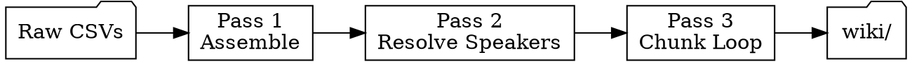

# Session Ingest

Multi-pass data mining of raw session transcription CSVs. Each pass produces a
checkpoint file so work survives context limits, partial transcriptions, and session
boundaries. Downstream consumers: `transcript-ingest.md`, `session-recap`,
`world-update`, `combat-analytics.md`, `player-interests.md`.

---

## Entry Point

Every invocation starts the same way:

```bash
python3 .claude/scripts/assemble_transcript.py status {NN}
```

This reports parts available, checkpoint state, and staleness. Then route:

| Status says | Do |
|---|---|
| Pass 1 stale or missing | Run `assemble {NN}` → continue to Pass 2 |
| Pass 2 not started | Read `references/speaker-resolution.md` → resolve speakers |
| Pass 2 done, resolved.csv missing | Run `resolve {NN}` → continue to Pass 3 |
| Pass 3 not started | Read `references/extraction-targets.md` → extract |
| Pass 3 done, flags unresolved | Present flags to DM → wait |
| All passes complete | Report status, nothing to do |

## Required Skill Chain

Run `ttrpg-llm-wiki-init` once at session start. Load `ttrpg-writing` when writing
prose for wiki pages. Sandbox rules are in CLAUDE.md (always loaded).

---

## Input

| File | Format | Location |
|---|---|---|
| Transcript parts | CSV: `ID,Start,End,Speaker,Text` | `audio/sessions/session{NN}-part{PP}.m4a.csv` |
| Dictionary | CSV: `Source,Target,Case Sensitive,Enabled` | `audio/sessions/shattered-sea-dictionary.csv` |

Parts arrive incrementally as audio transcribes. Process whatever is available —
the architecture handles additions.

## Working Directory

Each session: `audio/sessions/session{NN}/`

All intermediate files live here. These are checkpoints — resume from the latest one.

| File | Produced By | Purpose |
|---|---|---|
| `assembled.csv` | Pass 1 (script) | Dictionary-corrected, concatenated, continuous timestamps |
| `parts.txt` | Pass 1 (script) | Manifest of which parts were assembled |
| `speaker-map.md` | Pass 2 | Speaker resolution decisions with evidence |
| `resolved.csv` | Pass 2 (script) | Speaker-corrected transcript |
| `extracts.md` | Pass 3 (cumulative) | Tagged canon extracts organized by scene |
| `flags.md` | Pass 3 (cumulative) | Unresolved ambiguities for DM review |
| `progress.txt` | Pass 3 (per chunk) | Which line ranges have been processed |

---

## Pass Architecture



If a checkpoint file exists and its source data hasn't changed, skip that pass.
Use `status` to detect staleness before starting work.

---

### Pass 1: Assemble

**Scripted — no agent judgment needed.**

```bash
python3 .claude/scripts/assemble_transcript.py assemble {NN}
```

This finds all parts, applies dictionary corrections to text, concatenates with
continuous IDs and cumulative timestamps (all `H:MM:SS`), and writes
`assembled.csv`. It also reports speaker distribution and flags unresolved labels.

Re-run when new parts arrive — it overwrites from source CSVs.

**Checkpoint:** `assembled.csv` exists. `parts.txt` lists all available parts.
Run `status` to check for staleness (new parts since last assembly).

---

### Pass 2: Resolve Speakers

**Requires agent judgment.** Read `references/speaker-resolution.md`.

Input: `assembled.csv`
Output: `resolved.csv` + `speaker-map.md`

Goal: every "Speaker 1", "Speaker N", and "Unknown" label resolved to a known
speaker with evidence and confidence rating.

**Subagent strategy for large transcripts (3000+ lines):** Chunk into ~1500-line
windows with 100-line overlap (aim for 5–7 subagents total). Each subagent
resolves speakers in its chunk. Coordinating agent merges speaker maps (majority
vote on conflicts).

After the speaker map is written, produce `resolved.csv` mechanically:

```bash
python3 .claude/scripts/assemble_transcript.py resolve {NN}
```

This reads the speaker map table and applies label replacements to `assembled.csv`.
Low-confidence resolutions get a `?` prefix (e.g., `?Perrin`).

**Checkpoint:** `resolved.csv` exists and `speaker-map.md` has no `unknown`
confidence entries.

**Commit after this pass** — speaker resolution is durable work worth preserving:
```
fix: resolve speakers for session {NN} transcript
```

---

### Pass 3: Extract & Integrate (Sequential Chunk Loop)

**Requires agent judgment + wiki context.** Read `references/extraction-targets.md`.
Load `ttrpg-wiki-ingest` and read its `references/transcript-ingest.md`.

Input: `resolved.csv` + `wiki/hot.md` + relevant entity summaries
Output: `extracts.md` + `flags.md` + wiki file changes

This pass processes `resolved.csv` in sequential ~800-line chunks. Each chunk is
fully processed — extraction through wiki writes — before the next one begins.
This keeps context manageable and creates natural handoff points where an agent
can stop and a new one can resume.

#### Per-Chunk Work

For each chunk of ~800 lines (use scene boundaries when visible, line count
otherwise; keep ~20 lines of trailing context from the previous chunk for
continuity):

1. **Classify lines** as IC (in-character), OOC (out-of-character), or META
   (rules talk, dice rolls). A Florida food tangent is OOC even when spoken by
   "Delmar" — use surrounding context, not just speaker labels.

2. **Merge fragments.** Consecutive lines from the same speaker within 3 seconds
   with no intervening speaker → single utterance. The transcription tool produces
   many 1-second clips that are one sentence when merged.

3. **Identify scenes.** Scene breaks on: location change, significant time skip,
   major topic shift, new NPC entrance. Label each scene with location and
   participants.

4. **Extract canon per scene.** Use the tag types in `extraction-targets.md`.
   Every extract cites source line range from `resolved.csv`.

5. **Flag uncertainties.** Ambiguous canon, possible transcription errors with
   lore significance, speaker-dependent meaning → append to `flags.md`.

6. **Write to wiki.** For extracts in this chunk:
   - Append to session note (`wiki/sessions/session-{NN}.md`)
   - Create or update entity pages for NPCs, locations, items
   - Update `wiki/dm/combat-analytics.md` from `[COMBAT]` blocks
   - Update `wiki/dm/player-interests.md` from `[SIGNAL]` blocks
   - Update situation and faction files as needed

7. **Append to `extracts.md`** — the running extract log for this session.

8. **Record progress** — append the chunk's line range to `progress.txt`:
   ```
   chunk-1: lines 1-800 (2026-05-31)
   chunk-2: lines 781-1600 (2026-05-31)
   ```

9. **Commit:**
   ```
   ingest: session {NN} transcript chunk {N} (lines {start}–{end})
   ```

#### Resuming After Handoff

When a new agent picks up, check `progress.txt` to see which chunks are done.
Start the next chunk from the line after the last completed range (minus overlap).
Read the tail of `extracts.md` for context continuity.

#### Final Chunk

After the last chunk, do a final pass:
- Update `wiki/hot.md` to reflect end-of-session world state
- Verify `extracts.md` covers the full transcript timeline
- Review `flags.md` — present any unresolved items to the DM
- Commit:
  ```
  ingest: complete session {NN} transcript extraction
  ```

**Checkpoint files:** `extracts.md` (cumulative), `flags.md`, `progress.txt`.

---

## Incremental Processing

Audio parts arrive as transcription completes. Run `status` to detect what changed:

| Status says | Action |
|---|---|
| New parts, no previous work | Run all passes from scratch |
| New parts, Pass 1 done | Re-run `assemble` (script detects new parts via `parts.txt`), then resume Pass 2 |
| New parts, Pass 2 done | Re-run `assemble`, re-run `resolve` (speaker map still applies), resume Pass 3 from the first unprocessed chunk per `progress.txt` |
| New parts, Pass 3 partially done | Re-run `assemble` + `resolve`, continue Pass 3 from next unprocessed chunk — earlier chunks' wiki writes are already committed and don't need redoing |
| All parts present, all passes done | Report status, nothing to do |

The sequential chunk architecture makes incremental processing straightforward:
earlier chunks are fully committed, so new parts only add new chunks at the end.

---

## Invocation Modes

| Mode | Trigger | Action |
|---|---|---|
| `status` | "transcript status", "what's available" | List sessions with CSVs, report pass completion |
| `process` | "process session N transcript" | Run all passes for session N |
| `resume` | "continue session N" | Find latest checkpoint, resume |
| `speakers` | "fix speakers", "who is Speaker 1" | Run Pass 2 only |
| `extract` | "what happened in session N" | Run through Pass 3, report |
| `combat` | "combat stats from session N" | Extract `[COMBAT]` blocks only |

---

## Known Speaker Labels

| CSV Label | Identity | Notes |
|---|---|---|
| DM | Nick (game master) | Also voices all NPCs — context distinguishes |
| Delmar | Delmar Fisk's player | |
| Perrin | Perrin Black-Jaw's player | |
| Jean Claude | Jean-Claude Tabarnack's player | |
| Crissdalyn | Crissdalynn Khinriss's player | Label spelling ≠ character spelling |
| Speaker 1 | Usually Crissdalyn (mic drift) | Verify per session via speaker-resolution.md |
| Speaker 5/6/7 | Varies — cross-talk, external audio | Low line counts; often DM or non-game audio |
| Speaker N | Unknown | Always resolve before Pass 3 |

---

## Quality Gates

Before starting Pass 3 (chunk loop):
- All Speaker N labels resolved (medium+ confidence)

Per chunk (before committing):
- Extracts cite source line ranges from `resolved.csv`
- No `[CANON]` block contradicts existing wiki without a flag
- Wiki writes use wikilinks for all named entities

After final chunk:
- `extracts.md` scenes cover the full transcript timeline with no gaps
- `progress.txt` line ranges span the entire `resolved.csv`
- Combat encounters have round counts and per-PC action summaries
- `[SIGNAL]` blocks present if players showed clear engagement/disengagement
- All unresolved items in `flags.md` presented to DM
- `wiki/hot.md` reflects end-of-session world state

---

## Reference Files

| File | When |
|---|---|
| `references/speaker-resolution.md` | Pass 2 — resolving unknown speakers |
| `references/extraction-targets.md` | Pass 3 — what to extract and how to tag it |
