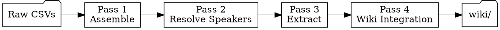

# Session Ingest

Multi-pass data mining of raw session transcription CSVs. Each pass produces a
checkpoint file so work survives context limits, partial transcriptions, and session
boundaries. Downstream consumers: `transcript-ingest.md`, `session-recap`,
`world-update`, `combat-analytics.md`, `player-interests.md`.

---

## Required Skill Chain

Run `ttrpg-llm-wiki-init` once at session start. Load `ttrpg-writing` when writing
prose for wiki pages. Sandbox rules are in CLAUDE.md (always loaded).

---

## Input

| File | Format | Location |
|---|---|---|
| Transcript parts | CSV: `ID,Start,End,Speaker,Text` | `audio/sessions/session{NN}-part{PP}.m4a.csv` |
| Dictionary | CSV: `Source,Target,Case Sensitive,Enabled` | `audio/sessions/shattered-sea-dictionary.csv` |

Parts arrive incrementally as audio transcribes. Process whatever is available —
the architecture handles additions.

## Working Directory

Each session: `audio/sessions/session{NN}/`

All intermediate files live here. These are checkpoints — resume from the latest one.

| File | Produced By | Purpose |
|---|---|---|
| `assembled.csv` | Pass 1 (script) | Dictionary-corrected, concatenated, continuous timestamps |
| `parts.txt` | Pass 1 (script) | Manifest of which parts were assembled |
| `speaker-map.md` | Pass 2 | Speaker resolution decisions with evidence |
| `resolved.csv` | Pass 2 | Speaker-corrected transcript |
| `extracts.md` | Pass 3 | Tagged canon extracts organized by scene |
| `flags.md` | Pass 3 | Unresolved ambiguities for DM review |

---

## Pass Architecture



If a checkpoint file exists and its source data hasn't changed, skip that pass.

---

### Pass 1: Assemble

**Scripted — no agent judgment needed.**

```bash
python3 .claude/scripts/assemble_transcript.py {NN}
```

This finds all parts, applies dictionary corrections to text, concatenates with
continuous IDs and cumulative timestamps, and writes `assembled.csv`. It also
reports speaker distribution and flags unresolved speaker labels.

Re-run when new parts arrive — it overwrites from source CSVs.

**Checkpoint:** `assembled.csv` exists. `parts.txt` lists all available parts.

---

### Pass 2: Resolve Speakers

**Requires agent judgment.** Read `references/speaker-resolution.md`.

Input: `assembled.csv`
Output: `resolved.csv` + `speaker-map.md`

Goal: every "Speaker 1", "Speaker N", and "Unknown" label resolved to a known
speaker with evidence and confidence rating.

**Subagent strategy for large transcripts (2000+ lines):** Chunk into 500-line
windows with 50-line overlap. Each subagent resolves speakers in its chunk. A
coordinating agent merges speaker maps (majority vote on conflicts).

**Checkpoint:** `resolved.csv` exists and `speaker-map.md` has no `unknown`
confidence entries.

**Commit after this pass** — speaker resolution is durable work worth preserving:
```
fix: resolve speakers for session {NN} transcript
```

---

### Pass 3: Scene Segmentation & Canon Extraction

**Requires agent judgment + wiki context.** Read `references/extraction-targets.md`.

Input: `resolved.csv` + `wiki/hot.md` + relevant entity summaries
Output: `extracts.md` + `flags.md`

Steps:

1. **Classify lines** as IC (in-character), OOC (out-of-character), or META
   (rules talk, dice rolls). A Florida food tangent is OOC even when spoken by
   "Delmar" — use surrounding context, not just speaker labels.

2. **Merge fragments.** Consecutive lines from the same speaker within 3 seconds
   with no intervening speaker → single utterance. The transcription tool produces
   many 1-second clips that are one sentence when merged.

3. **Identify scenes.** Scene breaks on: location change, significant time skip,
   major topic shift, new NPC entrance. Label each scene with location and
   participants.

4. **Extract canon per scene.** Use the tag types in `extraction-targets.md`.
   Every extract cites source line range.

5. **Flag uncertainties.** Ambiguous canon, possible transcription errors with
   lore significance, speaker-dependent meaning → `flags.md` for DM review.

**Subagent strategy:** Split `resolved.csv` into chunks by scene boundary (if
scenes already identified) or by ~400-line blocks with 20-line overlap. Each
subagent processes its chunk and returns scene segments + extracts. Coordinating
agent merges, deduplicates, and ensures scene continuity.

**Checkpoint:** `extracts.md` exists with at least one scene. Commit:
```
ingest: extract canon from session {NN} transcript
```

---

### Pass 4: Wiki Integration

**Uses existing pipeline.** Load `ttrpg-wiki-ingest` and read its
`references/transcript-ingest.md`.

Input: `extracts.md` + `flags.md` (resolved)
Output: Wiki file changes

Before starting: verify `flags.md` has no unresolved items that would block canon.
If it does, present flags to the DM and wait.

This pass produces:
- Session note: `wiki/sessions/session-{NN}.md`
- Entity pages: new or updated
- `wiki/dm/combat-analytics.md`: from `[COMBAT]` blocks
- `wiki/dm/player-interests.md`: from `[SIGNAL]` blocks
- Situation and faction updates
- `wiki/hot.md` refresh

The existing `transcript-ingest.md` reference has the full protocol. The key
difference: your input is `extracts.md` (structured, tagged, scene-organized) rather
than a raw transcript. Skip the cleaning steps — they were Passes 1–3.

**Checkpoint:** Session note exists and `hot.md` updated date matches.

---

## Incremental Processing

Audio parts arrive as transcription completes. Handle each case:

| State | Action |
|---|---|
| New parts, no previous work | Run all passes |
| New parts, Pass 1 done | Re-run Pass 1 (script detects new parts), resume Pass 2 |
| New parts, Pass 2+ done | Re-run Pass 1, diff assembled.csv, extend speaker map for new lines, re-run Pass 3 for new content |
| All parts present, all passes done | Nothing to do — report status |

The `parts.txt` manifest tracks which parts were assembled. When new parts appear,
the script output changes, which invalidates downstream checkpoints.

---

## Invocation Modes

| Mode | Trigger | Action |
|---|---|---|
| `status` | "transcript status", "what's available" | List sessions with CSVs, report pass completion |
| `process` | "process session N transcript" | Run all passes for session N |
| `resume` | "continue session N" | Find latest checkpoint, resume |
| `speakers` | "fix speakers", "who is Speaker 1" | Run Pass 2 only |
| `extract` | "what happened in session N" | Run through Pass 3, report |
| `combat` | "combat stats from session N" | Extract `[COMBAT]` blocks only |

---

## Known Speaker Labels

| CSV Label | Identity | Notes |
|---|---|---|
| DM | Nick (game master) | Also voices all NPCs — context distinguishes |
| Delmar | Delmar Fisk's player | |
| Perrin | Perrin Black-Jaw's player | |
| Jean Claude | Jean-Claude Tabarnack's player | |
| Crissdalyn | Crissdalynn Khinriss's player | Label spelling ≠ character spelling |
| Speaker 1 | Usually Crissdalyn (mic drift) | Verify per session via speaker-resolution.md |
| Speaker N | Unknown | Always resolve before Pass 3 |

---

## Quality Gates

Before Pass 4 (wiki integration):
- All Speaker N labels resolved (medium+ confidence)
- No unreviewed flags in `flags.md`
- `extracts.md` scenes cover the full transcript timeline
- Combat encounters have round counts and per-PC action summaries
- No `[CANON]` block contradicts existing wiki without a flag
- `[SIGNAL]` blocks present if players showed clear engagement/disengagement

---

## Reference Files

| File | When |
|---|---|
| `references/speaker-resolution.md` | Pass 2 — resolving unknown speakers |
| `references/extraction-targets.md` | Pass 3 — what to extract and how to tag it |
