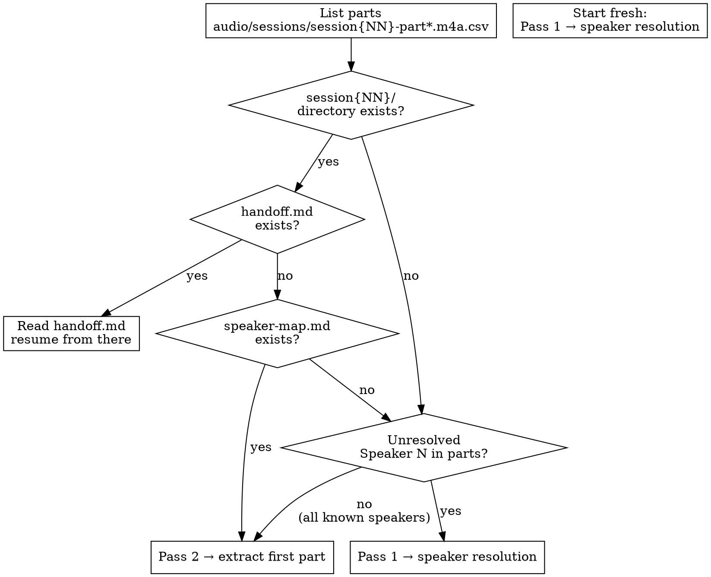
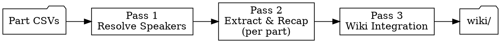

# Session Ingest

Multi-pass data mining of raw session transcription CSVs. Each part file is one
chunk — process them sequentially, one per agent turn. Checkpoints after every
part so work survives context limits and session boundaries.

Downstream consumers: `transcript-ingest.md`, `session-recap`, `world-update`,
`combat-analytics.md`, `player-interests.md`.

---

## Entry Point



Every invocation:

1. List available parts: `ls audio/sessions/session{NN}-part*.m4a.csv`
2. Check for working directory: `audio/sessions/session{NN}/`
3. If `handoff.md` exists → read it and resume where it says
4. If `speaker-map.md` exists but no handoff → start Pass 2 (extraction)
5. If neither exists → check parts for Speaker N labels → Pass 1 if needed, else straight to Pass 2

## Required Skill Chain

Run `ttrpg-llm-wiki-init` once at session start. Load `ttrpg-writing` when writing
prose for wiki pages. Sandbox rules are in CLAUDE.md (always loaded).

---

## Input

| File | Format | Location |
|---|---|---|
| Transcript parts | CSV: `ID,Speaker,Text` | `audio/sessions/session{NN}-part{PP}.m4a.csv` |

Each part is one audio segment (~250–1000 lines). The transcription tool applies
the custom dictionary automatically — CSVs already have corrected spellings.
Parts arrive incrementally. Process whatever is available.

**Each part file is one chunk.** Do not combine parts into a single file. Process
them in order: part00, part01, part02, etc.

## Working Directory

Each session: `audio/sessions/session{NN}/`

All intermediate files live here. These are checkpoints — resume from the latest.

| File | Produced By | Purpose |
|---|---|---|
| `speaker-map.md` | Pass 1 | Speaker resolution decisions with evidence |
| `recap.md` | Pass 2 (cumulative) | Condensed IC-only scene summaries |
| `extracts.md` | Pass 2 (cumulative) | Tagged canon extracts organized by scene |
| `flags.md` | Pass 2 (cumulative) | Unresolved ambiguities for DM review |
| `combat-summary.md` | Pass 2 (after final part) | Structured per-PC combat data for primer updates |
| `progress.txt` | Pass 2 (per part) | Which parts have been processed |
| `handoff.md` | Pass 2 (per part) | Self-contained prompt for the next agent |

---

## Pass Architecture



Three passes, not four. Parts are processed directly — no assembly step.

---

### Pass 1: Resolve Speakers

**Requires agent judgment.** Read `references/speaker-resolution.md`.

Input: all `session{NN}-part*.m4a.csv` files
Output: `speaker-map.md`

Goal: every "Speaker 1", "Speaker N", and "Unknown" label mapped to a known
identity with evidence and confidence.

#### Procedure

1. **Quick scan** — grep each part for non-standard speaker labels:
   ```bash
   grep -h 'Speaker' audio/sessions/session{NN}-part*.m4a.csv | \
     cut -d',' -f2 | sort | uniq -c | sort -rn
   ```
   If no Speaker N labels exist (only DM, Delmar, Perrin, Jean Claude,
   Crissdalyn), skip this pass entirely.

2. **Sample context windows** — for each unknown label, read 10–15 lines of
   surrounding context from the raw CSVs. Use conversational flow, process of
   elimination, temporal clustering, and speech patterns per the reference doc.

3. **Build speaker map** — write `speaker-map.md` with the standard table format
   (see reference). Every resolution needs a confidence level and evidence.

4. **Commit:**
   ```
   fix: resolve speakers for session {NN} transcript
   ```

**Skip condition:** If all speaker labels are known identities, no speaker map
needed. Note this in `progress.txt` line 1: `speakers: all known (no map needed)`

**Checkpoint:** `speaker-map.md` exists with no `unknown` confidence entries
(or skip noted in progress.txt).

---

### Pass 2: Extract & Recap (One Part Per Agent)

**Requires agent judgment.** Read `references/extraction-targets.md`.

Input: raw part CSV + `speaker-map.md` (if exists) + `wiki/hot.md` (for context)
Output: `recap.md` + `extracts.md` + `flags.md` (all cumulative)

**Each agent processes exactly one part file, commits, writes a handoff, and
stops.** The next agent picks up from the handoff. No wiki writes happen here.

#### Before Your First Line of Work

Read these files (skip any that don't exist yet):
- `progress.txt` — which parts are done
- Tail of `recap.md` — last 2 scenes for continuity
- `flags.md` — any open flags
- `speaker-map.md` — speaker resolutions to apply

#### Processing One Part

1. **Identify your part.** Check `progress.txt` — the last entry names the last
   completed part. Your part is the next one numerically. If `progress.txt`
   doesn't exist, start with part00.

2. **Read the part CSV.** Read the full file — parts are sized for one agent's
   context window. Also read the last ~20 lines of the previous part for
   continuity (if not part00).

3. **Apply speaker map.** As you read, mentally replace Speaker N labels per
   `speaker-map.md`. Prefix uncertain resolutions with `?` in your extracts.

4. **Classify lines** — IC (in-character), OOC (out-of-character), or META
   (rules talk, dice rolls). Use surrounding context, not just speaker labels.
   A real-world tangent is OOC even when spoken by a character-labeled speaker.

5. **Merge fragments.** Consecutive lines from the same speaker with no
   intervening speaker → single utterance. The transcription tool splits
   sentences across many 1-second lines.

6. **Identify scenes.** Scene breaks: location change, significant time skip,
   major topic shift, new NPC entrance. Label each with location and
   participants. A scene started in a previous part may continue into this one —
   check the recap tail for the active scene.

7. **Extract canon per scene.** Use the tag types in `extraction-targets.md`.
   Every extract cites the part number and original CSV line IDs:
   `Source: part{PP} lines {start}–{end}`

8. **Flag uncertainties.** Ambiguous canon, transcription errors with lore
   significance, speaker-dependent meaning → append to `flags.md`.

9. **Append to `recap.md`** — condensed IC-only scene summaries.

10. **Append to `extracts.md`** — tagged extracts with citations.

11. **Record progress:**
    ```
    part{PP}: {line_count} lines ({YYYY-MM-DD})
    ```

12. **Commit:**
    ```
    ingest: session {NN} transcript chunk {N} (part{PP})
    ```

13. **Write handoff and stop.** Overwrite `handoff.md` with current state, then
    **stop — do not process the next part.**

#### Scene Continuity Across Parts

A scene often spans multiple parts. When the previous recap's last scene is still
active at the start of your part:
- Do NOT create a new scene heading — append to the existing scene
- In `recap.md`, note the continuation: update the scene's participant list and
  extend the summary
- In `extracts.md`, add new extracts under the same scene heading

When the scene does end mid-part, close it and start a new scene heading as
normal.

#### Recap Format

```markdown
# Session {NN} Recap

Source: audio/sessions/session{NN}-part*.m4a.csv
Extraction date: {YYYY-MM-DD}

---

## Scene 1: {Location} — {Brief label}
*Part {PP} | {Participants}*

{1–3 sentences of what happened in-game. Factual, not narrative. Name NPCs
and PCs on first mention. Note items exchanged, decisions made, information
revealed.}

---

## Scene 2: ...
```

The recap reads like a concise event log — every consequential in-game event
without OOC or mechanical details. Combat gets outcome and consequences, not
blow-by-blow.

#### Handoff Format

Overwrite `handoff.md` after every part. The next agent reads ONLY this file
to orient — make it self-contained.

```markdown
# Session Ingest Handoff — Session {NN}

## Status
- Parts completed: {list, e.g. 00–05}
- Parts remaining: {list, e.g. 06, 07, 08}
- Last scene in recap: "{scene label}"
- Open flags: {count}

## Next Action
Process part{PP} of session {NN} transcript using the `session-ingest` skill.

## Context for Next Part
{3–5 sentences: what was happening at the end of this part — the active scene,
who was talking, any thread mid-conversation. If something important is about
to happen in the next part (you can tell from trailing context), mention it.
Enough for the next agent to maintain perfect continuity.}

## Files to Read First
- `audio/sessions/session{NN}/progress.txt` — part history
- Tail of `audio/sessions/session{NN}/recap.md` — last 2 scenes for continuity
- `audio/sessions/session{NN}/flags.md` — open flags
- `audio/sessions/session{NN}/speaker-map.md` — speaker resolutions
```

#### Final Part

When you finish the last available part:
- Verify `recap.md` covers the full session with no gaps between parts
- Verify `extracts.md` has tagged entries for every recap scene
- If any `[COMBAT]` blocks exist in `extracts.md`, compile them into
  `combat-summary.md` (see format below)
- Review `flags.md` — present unresolved items to the DM
- Write `handoff.md` indicating Pass 2 is complete and Pass 3 (wiki) is next
- If combat data was extracted, add to handoff:
  `Combat data available — run pc-combat-primer to update affected profiles.`
- Commit:
  ```
  ingest: complete session {NN} transcript extraction and recap
  ```

#### combat-summary.md Format

Compile all `[COMBAT]` blocks from `extracts.md` into a single file optimized
for `pc-combat-primer` consumption. This file is the bridge between ingest and
primer workflows — it saves the primer skill from re-reading raw transcripts.

```markdown
# Session {NN} Combat Summary

Source: audio/sessions/session{NN}/extracts.md
Compiled: {YYYY-MM-DD}
Encounters: {count}

---

## Encounter 1: {name}
{Full [COMBAT] block from extracts.md — header, per-PC table, party state}

---

## Encounter 2: ...
```

---

### Pass 3: Wiki Integration

**Uses existing pipeline.** Load `ttrpg-wiki-ingest` and read its
`references/transcript-ingest.md`. Load `ttrpg-writing` for prose standards.

Input: `recap.md` + `extracts.md` + `flags.md` (resolved)
Output: Wiki file changes

Before starting: verify `flags.md` has no unresolved items that would block
canon. If it does, present flags to the DM and wait.

| Wiki Target | Primary Source |
|---|---|
| Session note (`wiki/sessions/session-{NN}.md`) | `recap.md` scenes |
| Entity pages (NPCs, locations, items) | `recap.md` + `[NPC]`/`[ITEM]` extracts |
| `wiki/dm/combat-analytics.md` | `[COMBAT]` extracts |
| PC combat profiles (`wiki/dm/{pc}-combat-profile.md`) | `combat-summary.md` (via `pc-combat-primer`) |
| `wiki/dm/player-interests.md` | `[SIGNAL]` extracts |
| Situation and faction files | `[CANON]` extracts + `recap.md` |
| `wiki/hot.md` | `recap.md` end state |

Commit:
```
ingest: wiki integration from session {NN} transcript
```

**Checkpoint:** Session note exists and `hot.md` updated date matches.

---

## Incremental Processing

Parts arrive as audio transcribes. The part-per-chunk architecture handles
this naturally:

| State | Action |
|---|---|
| New parts, no previous work | Pass 1 (if needed) → Pass 2 starting at part00 |
| New parts, extraction in progress | Continue from next unprocessed part per `progress.txt` — earlier parts are committed |
| All parts done, wiki not started | Pass 3 |
| All passes done, new parts appear | Process only the new parts (append to recap/extracts) |

Earlier parts' extractions are fully committed and immutable. New parts only
add new work at the end.

---

## Invocation Modes

| Mode | Trigger | Action |
|---|---|---|
| `status` | "transcript status", "what's available" | List sessions with CSVs, report progress |
| `process` | "process session N transcript" | Run all passes for session N |
| `resume` | "continue session N" | Read `handoff.md` → process next part |
| `speakers` | "fix speakers", "who is Speaker 1" | Run Pass 1 only |
| `extract` | "what happened in session N" | Run through Pass 2, report |
| `combat` | "combat stats from session N" | Extract `[COMBAT]` blocks with structured per-PC tables; produce `combat-summary.md` |

---

## Known Speaker Labels

| CSV Label | Identity | Notes |
|---|---|---|
| DM | Nick (game master) | Also voices all NPCs — context distinguishes |
| Delmar | Delmar Fisk's player | |
| Perrin | Perrin Black-Jaw's player | |
| Jean Claude | Jean-Claude Tabarnack's player | |
| Crissdalyn | Crissdalynn Khinriss's player | Label spelling != character spelling |
| Speaker 1 | Usually Crissdalyn (mic drift) | Verify per session via speaker-resolution.md |
| Speaker 5/6/7 | Varies — cross-talk, external audio | Low line counts; often DM or non-game audio |
| Speaker N | Unknown | Always resolve before Pass 2 |

---

## Quality Gates

Before starting Pass 2:
- All Speaker N labels resolved (medium+ confidence) or confirmed absent

Per part (before committing):
- Extracts cite part number and source line IDs
- Recap covers only in-game events (no OOC, no meta)
- No `[CANON]` block contradicts existing wiki without a flag
- Scene continuity maintained from previous part's recap

After all parts (before Pass 3):
- `recap.md` covers full session timeline with no scene gaps between parts
- `extracts.md` has tagged entries for every scene in the recap
- `progress.txt` lists every part
- Every `[COMBAT]` block uses the structured format: encounter header + per-PC table + party state (see `extraction-targets.md`)
- If any combat occurred: `combat-summary.md` exists with all encounters compiled
- `[SIGNAL]` blocks present if players showed clear engagement/disengagement
- All unresolved items in `flags.md` presented to DM

After Pass 3:
- Session note exists with wikilinks for all named entities
- `wiki/hot.md` reflects end-of-session world state

---

## Migrating In-Progress Sessions

Sessions started under the old skill version may have `assembled.csv`,
`resolved.csv`, and line-range-based `progress.txt` entries (e.g.
`chunk-3: lines 1630–2450`). To continue these:

1. Ignore `assembled.csv`, `resolved.csv`, and `parts.txt` — these are
   legacy intermediates. Read raw part CSVs instead.
2. Find where you left off by content, not line arithmetic: read the last
   scene in `recap.md` (or the handoff's context block), then scan the
   first ~10 lines of each part CSV to find which part starts after the
   last recap content. Part IDs restart at 1 per file and do not match
   `assembled.csv` line numbers.
3. Start processing from that part file onward.
4. Switch `progress.txt` to the new format going forward:
   ```
   # legacy (old format):
   chunk-3: lines 1630–2450 (2026-06-01)
   # new format:
   part04: 779 lines (2026-06-01)
   ```
5. The handoff may reference `resolved.csv` — ignore that, read raw parts +
   speaker-map.md instead.

---

## Reference Files

| File | When |
|---|---|
| `references/speaker-resolution.md` | Pass 1 — resolving unknown speakers |
| `references/extraction-targets.md` | Pass 2 — what to extract and how to tag it |
