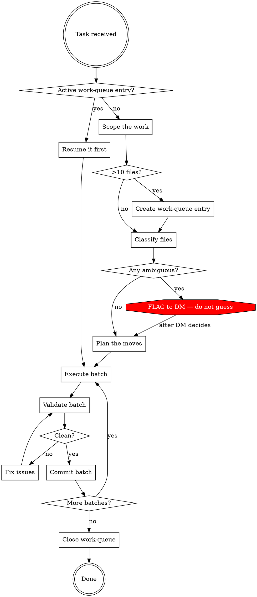

# TTRPG Wiki Organize

Proactive organizer for the LLM-wiki file and folder structure. Audits the
`wiki/` tree against the canonical structure, identifies misplaced files,
proposes and executes moves, and ensures every change is tracked in git with
zero broken links or stale frontmatter.

**Core principle:** The agent navigates by path prediction, not search (P1).
If a file is in the wrong place, every future agent that touches it wastes
context finding it. Organization is not cosmetic — it is infrastructure.

---

## When to Use

- Files sitting at a directory root that have obvious subfolder targets
- `type`/`subtype` frontmatter doesn't match the file's path
- A directory exists that the canonical tree doesn't define
- After bulk ingest — new files often land unsorted
- DM asks for a structural audit or cleanup
- Wiki-lint reports `type-path-mismatch` warnings

## When NOT to Use

- Content quality issues (summaries, prose, wikilinks) → `ttrpg-wiki-lint`
- Frontmatter field completion → the write hook handles it
- Cross-linking / orphan resolution → `cross-linker`
- Lore contradictions → `ttrpg-wiki-lint` manual review
- Session-start health check → `ttrpg-llm-wiki-init`

---

## Required Pre-Reads

| # | File | Why |
|---|---|---|
| 1 | `CLAUDE.md` | Sandbox rules, ideal state, hook behaviors |
| 2 | `.claude/skills/ttrpg-llm-wiki-init/references/universal-structure.md` | Canonical folder tree and content decision tree |
| 3 | `.claude/skills/ttrpg-llm-wiki-init/references/frontmatter-defaults.md` | type/subtype mapping by path |
| 4 | `wiki/work-queue.md` | Check for active tasks before starting |

---

## The Protocol



---

## Step 1 — Scope the Work

Run the structural audit to discover what needs organizing:

```bash
# Files at a directory root that have subfolders available
find wiki/entities/places -maxdepth 1 -name '*.md' ! -name 'index.md' | wc -l

# Type/subtype vs path mismatches
python3 .claude/scripts/wiki_lint.py 2>&1 | grep -i "type-path-mismatch"

# Directories not in the canonical tree
find wiki -type d | sort
```

Compare against the canonical tree in `universal-structure.md`. Produce a
table of every file that is misplaced, every directory that shouldn't exist,
and every missing directory that should.

**If more than 10 files need moving: create a `wiki/work-queue.md` entry
BEFORE touching any files.** This is not optional — P7 requires it.

---

## Step 2 — Classify Each File

For every misplaced file, determine its correct home using the Content Type →
Path Decision Tree from `universal-structure.md`. Read the file's frontmatter
and first paragraph — classification requires understanding what the entity IS.

### Classification Rules

1. **Path is derived from content, not the other way around.** Read the file.
   Don't guess from the filename.
2. **One subfolder per file.** If a file could go in two places, pick the more
   specific one. A building inside a settlement goes in `buildings/`, not
   `settlements/`.
3. **Settlement subfolders are allowed.** `settlements/calveno/` containing
   sub-location files is correct P2 usage — depth proportional to engagement.
4. **`-dm.md` suffix files stay next to their counterpart.** `galewall-dm.md`
   goes wherever `galewall.md` goes. The suffix is an audience-split pattern,
   not a routing signal to the `dm/` directory.
5. **`entities/creatures/` is an accepted divergence.** This wiki stores
   creature stat blocks at `entities/creatures/` with `type: monster`. The
   canonical tree says `lore/creatures/` but the linter, hooks, and prep
   skills all reference `entities/creatures/`. Do not mass-move creatures
   unless the DM explicitly requests it.
6. **Never create a new top-level wiki/ directory without DM approval.**
7. **Slug-directory collisions.** If a file's slug matches an existing
   subfolder name (e.g., `warren.md` alongside `settlements/warren/`), check
   whether the file is the parent overview for that subfolder. If yes, move it
   into the subfolder as `index.md` or leave it as the subfolder's root file.
   If no, flag to the DM — the collision suggests a possible duplicate.
8. **Index files move with their directory.** If a directory has an `index.md`,
   it stays. If you're moving all files out of a directory, move the index too
   or delete it if it becomes empty.

### Ambiguous Files — Escalate

If you cannot confidently classify a file into one subfolder:

```
FLAG: ambiguous-placement — {file} — could be {option-A} or {option-B} — {why it's unclear}
```

Surface these to the DM. **Do not guess.** Move only the files you're certain
about. An ambiguous file in the wrong subfolder is worse than a file at the
directory root — at least the root is honest about not being sorted.

---

## Step 3 — Plan the Moves

Group moves into batches by target directory. Each batch is one commit.

```markdown
## Batch 1: entities/places/ → entities/places/regions/
- crown-islands.md → regions/
- central-strait.md → regions/
- midchain.md → regions/

## Batch 2: entities/places/ → entities/places/islands/
- calven.md → islands/
- dreth.md → islands/
```

For each batch, list:
- Files to move
- Target directory (create if missing)
- Frontmatter fields to update (`subtype`, possibly `type`)
- Known inbound wikilinks (count, not exhaustive list)

---

## Step 4 — Execute a Batch

For each batch, execute in this exact order:

### 4a. Create target directory if needed
```bash
mkdir -p wiki/entities/places/planes
```

### 4b. Move files with git mv
```bash
git mv wiki/entities/places/elemental-plane-of-water.md wiki/entities/places/planes/
```

**Always use `git mv`.** Never `mv` then `git add`. `git mv` records the
rename, preserving `git log --follow` history.

### 4c. Update frontmatter to match new path

After moving, the file's `type` and `subtype` must match its new path per
`frontmatter-defaults.md`. Edit the frontmatter:

```yaml
# Before (at entities/places/ root):
type: entity
subtype: place

# After (in entities/places/planes/):
type: entity
subtype: plane
```

### 4d. Check for explicit path references

```bash
grep -r "entities/places/elemental-plane-of-water" wiki/ packages/ --include="*.md" --include="*.ts"
```

Obsidian wikilinks (`[[slug]]`) resolve by filename, not path — most survive
moves. But explicit path references in code, CLI tools, or markdown links
will break. Fix these before committing.

### 4e. Check for skill/script path references

```bash
grep -r "entities/places/" .claude/skills/ .claude/scripts/ packages/ --include="*.md" --include="*.ts" --include="*.py"
```

If any skill or script hardcodes the old path, update it in the same batch.

---

## Step 5 — Validate the Batch

After executing a batch, run validation BEFORE committing:

```bash
# 1. Lint — check for new errors introduced by the move
python3 .claude/scripts/wiki_lint.py --min-severity error 2>&1 | head -30

# 2. Wikilink check — any new broken links?
python3 .claude/scripts/wiki_lint.py 2>&1 | grep "broken-wikilink"

# 3. Type/path alignment — did we fix or introduce mismatches?
python3 .claude/scripts/wiki_lint.py 2>&1 | grep "type-path-mismatch"

# 4. Index regeneration (the hook does this, but verify)
python3 .claude/scripts/regen_index.py --write
```

**A batch is clean when the linter reports zero new errors compared to
before the batch started.** If new errors appear, fix them before committing.

### Rollback

If validation reveals cascading breakage you can't resolve:

```bash
git checkout -- .
```

This reverts all unstaged changes. Since you haven't committed yet, nothing
is lost. Reassess the batch plan before retrying.

---

## Step 6 — Commit the Batch

```bash
git add wiki/entities/places/planes/ wiki/entities/places/elemental-plane-of-water.md
git commit -m "fix: sort place files into planes/ — elemental-plane-of-water"
```

Commit prefix: `fix:` for structural corrections.

One commit per batch (per target directory). This makes `git bisect` useful
if something breaks later.

After committing, update `wiki/work-queue.md` if one exists — mark completed
files, update the "Resume from" pointer.

---

## Step 7 — Close the Work Queue

After all batches are committed and validated:

1. Mark the work-queue entry complete
2. Run a final full lint: `python3 .claude/scripts/wiki_lint.py --summary`
3. Report to the DM:

```
## Organization Summary
- Files moved: N across M batches
- Directories created: K
- Directories removed: J
- Frontmatter updated: N files
- Wikilinks fixed: N
- Remaining flags: {list any ambiguous files not moved}
- Final lint: {summary line}
```

---

## Red Flags — STOP and Reassess

- **Moving more than 30 files without a work queue** — stop, create the queue
- **Guessing where an ambiguous file goes** — stop, flag to DM
- **Skipping validation after a batch** — stop, run the linter
- **Using `mv` instead of `git mv`** — stop, undo, use `git mv`
- **Committing with lint errors** — stop, fix first
- **Creating a new top-level wiki/ directory** — stop, get DM approval
- **Mass-moving `entities/creatures/`** — stop, this is an accepted divergence
- **Moving `-dm.md` files to `dm/`** — stop, they stay with their counterpart
- **Editing file content during an organize pass** — stop, organize is
  structural only; content changes are a separate task

---

## Common Rationalizations

| Excuse | Reality |
|---|---|
| "The move is obvious, no queue needed" | P7 says 10+ files = queue. No exceptions. |
| "I'll fix the frontmatter later" | Frontmatter must match path immediately. Stale frontmatter is a lie the linter will catch and the next agent will pay for. |
| "Wikilinks resolve by slug, so moves are safe" | Code paths, scripts, and skills may use explicit paths. Always check. |
| "This file could go either way, I'll just pick one" | Ambiguous files get flagged to the DM. A wrong placement is worse than no placement. |
| "I'll validate everything at the end" | Validate per batch. A cascading error across 5 batches is 5x harder to debug than catching it in batch 1. |
| "The linter has warnings, but no errors" | Warnings from type-path-mismatch ARE the signal. Don't ignore them. |
| "I should also fix the content while I'm in the file" | Organize is structural. Content changes are a separate task with a separate commit. |
| "creatures/ should really be under lore/" | The whole wiki references `entities/creatures/`. Mass-moving is a DM decision, not a judgment call. |

---

## Accepted Divergences

These patterns differ from `universal-structure.md` but are intentional in
this wiki. Do not "fix" them:

| Pattern | Canonical | Why it stays |
|---|---|---|
| `entities/creatures/` | `lore/creatures/` | 129 files, all skills/hooks/scripts reference it |
| `narrative-islands/` | `islands/` | Campaign-specific naming; distinct from `entities/places/islands/` |
| `rules/backgrounds/`, `rules/classes/`, `rules/conditions/`, `rules/subclasses/` | Not in canonical tree | Sensible extensions for a 5e campaign |
| Settlement subfolders (`settlements/calveno/`) | Not explicitly in canonical | P2 depth-proportional-to-engagement |
| `-dm.md` suffix files | Not canonical pattern | Audience-split colocation; works with the `audience:` field |

---

## Reference Files

| File | Load when |
|---|---|
| `.claude/skills/ttrpg-llm-wiki-init/references/universal-structure.md` | Checking canonical tree, using content decision tree |
| `.claude/skills/ttrpg-llm-wiki-init/references/frontmatter-defaults.md` | Updating frontmatter after a move |
| `.claude/skills/ttrpg-llm-wiki-init/references/auto-correct.md` | Commit message format and escalation protocol |
